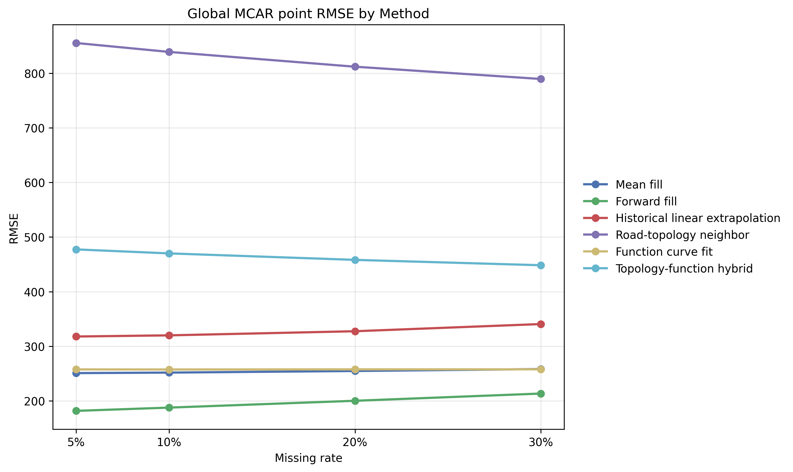
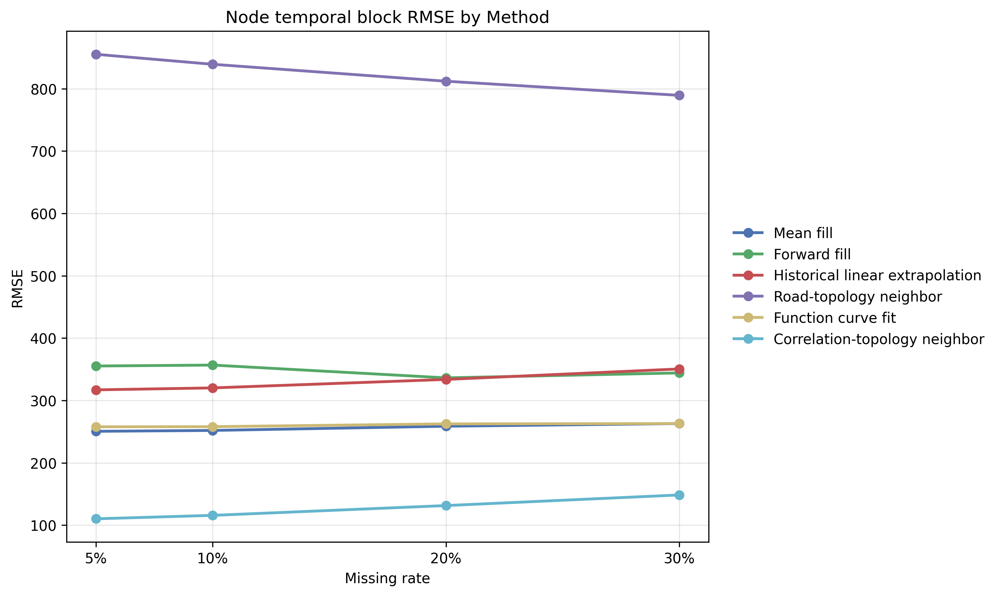
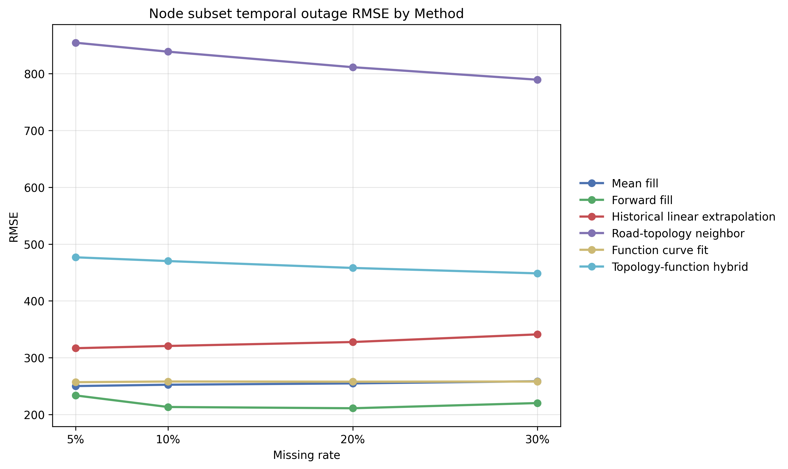
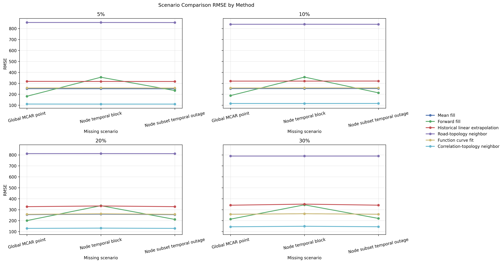

# 真实数据缺失值设置与缺失值补全实验

## 实验定位与设计目标

在正式论文结构中，真实数据缺失值设置与缺失值补全实验可视为真实数据分析链路中的上游鲁棒性验证模块，其职责并不是替代后续联邦交通流预测实验，而是在真实节点级流量序列已经完成清洗、聚合与完整性核验的前提下，进一步检验观测缺失对数据可用性的影响，以及不同补全策略在严格因果约束下恢复真实信号的能力。与前期仿真实验强调标准 FedAvg 在受控 Non-IID 条件下的预测有效性不同，本模块关注的是“真实输入数据在缺失扰动下的可恢复性”，因此报告的核心评价对象是 masked-position imputation error，而不是交通流预测误差。

本实验延续项目在前期模块中的统一写作口径与证据组织方式，围绕以下三个目标展开：

1. 在真实节点级交通流数据上构造可复现、可审计的缺失场景，覆盖全局点级完全随机缺失、两类时间结构化非随机缺失以及一类空间邻域约束缺失；
2. 在严格历史因果约束下，对六种正式补全方法进行一致评估，比较其在不同缺失比例和不同缺失结构下的误差表现；
3. 为后续真实数据预测实验提供数据质量鲁棒性证据，并与前期仿真实验中关于图结构、周期性与异质性影响的结论形成上游数据层面的交叉验证。

需要强调的是，项目在 `results\rdm_exp` 目录下一共登记了四类缺失场景：`g_mcar_pt`、`ntb_mix`、`nso_mix` 和 `snh_mix`。其中，当前可直接用于正式主结果分析的为三类 ready 场景：`g_mcar_pt`、`ntb_mix` 和 `nso_mix`；`snh_mix` 在注册表中仍处于 `in_progress`，因此本文将其列入场景定义范围，但不纳入本稿正式主结论与主结果表统计。

## 真实数据基础与前序链路衔接

前期真实数据预处理结果表明，项目已经形成了从原始路段与路网文件到节点级流量时序数据的完整转换链路。当前真实数据实验的直接输入目录为 `data\analysis\node_intersection_flow_parquet`，该目录对应 61 个日分片、42,031 个节点、每日 96 个时间片的节点级流量观测。预处理审计显示，总唯一观测对数为 `246,133,536`，缺失记录、重复记录、空值、NaN 与负值计数均为 `0`，说明缺失实验并不是在原始脏数据上“被动修补”，而是在完整基准数据上“主动施加可控缺失”，从而保证补全误差可以与真实值逐点对照。

从方法链路上看，本实验与前期仿真实验之间存在三层衔接关系。第一，二者都采用日内 96 时间片组织的时序结构，强调交通状态的周期性规律；第二，二者都将道路拓扑视为重要的空间先验，只是仿真实验在预测模型内部利用图结构，本实验则在数据补全过程中利用 `rnsd_processed.csv` 提供的拓扑邻接；第三，二者都强调避免把不同任务的指标混为一谈，仿真实验报告预测误差，本实验报告补全误差。因而，本模块的意义在于回答：在真实数据已经满足较高完整性标准的前提下，若后续观测链路出现可控缺失，哪些补全策略能够最大程度保留原始信号结构，从而为下游联邦训练提供更稳定的输入。

## 实验环境配置与可复现性

**表 1 实验环境与关键复现参数**

| 项目 | 配置 |
|---|---|
| 操作系统 | Windows |
| Shell | PowerShell `5.1.19041.1682` |
| Python | `3.12.3` |
| numpy | `1.26.4` |
| pandas | `2.2.3` |
| pyarrow | `16.1.0` |
| scipy | `1.13.1` |
| matplotlib | `3.9.2` |
| 输入目录 | `data\analysis\node_intersection_flow_parquet` |
| 拓扑文件 | `data\processed\rnsd_processed.csv` |
| 目标列 | `路口车流量` |
| 节点列 | `节点ID` |
| 时间列 | `时间段` |
| 日内周期 | `96` |
| 随机种子 | `42` |
| 历史窗口 | `7` 天 |
| warmup | `7` 天 |
| 主指标是否排除 warmup | `True` |

纳入本稿主结果统计的三类 ready 场景，其核心实现代码主要来自以下四个脚本：

| 脚本 | 作用 |
|---|---|
| `analysis_scripts\global_missingness_setting_pipeline.py` | 生成 `g_mcar_pt` 全局点级缺失并输出审计结果 |
| `analysis_scripts\structured_missingness_setting_pipeline.py` | 生成 `ntb_mix` 与 `nso_mix` 两类结构化缺失场景 |
| `analysis_scripts\global_missingness_imputation_pipeline.py` | 执行 `g_mcar_pt` 的六方法补全、统计与绘图 |
| `analysis_scripts\structured_missingness_imputation_pipeline.py` | 执行 `ntb_mix`、`nso_mix` 的六方法补全、长度组统计与绘图 |

`snh_mix` 的设置与补全则分别使用 `analysis_scripts\spatial_neighbor_holdout_setting_pipeline_fast.py`、`analysis_scripts\spatial_neighbor_holdout_imputation_pipeline.py` 和 `analysis_scripts\visualize_spatial_neighbor_holdout_results.py`。由于该场景目前仍处于扩展验证阶段，相关脚本与产物在本稿中只用于“未完成场景说明”，不进入主结果统计段落。

为保证复现性，项目在各场景目录下均保存了 `run_config.json`、`run_config_imputation.json`、审计报告、汇总 CSV 和图件索引。场景注册、状态字段、路径索引与备注统一由 `results\rdm_exp\experiment_registry.json` 管理；本文所有“主结果”“主表”“正式结论”等表述，若未特别说明，均仅指注册状态为 `ready` 且已纳入本稿统计的三类场景。

## 实验数据来源与预处理说明

### 数据来源与规模

真实数据链路的原始输入包括 `link_gps.v2`、`road_network_sub-dataset.v2` 与 `traffic_speed_sub-dataset.v2`，其后经过路段静态信息清洗、速度观测拼接、交通指标派生和节点级流量聚合，形成节点日分片 Parquet 数据。前序预处理结果给出的关键规模如下：

**表 2 真实数据基线规模与质量摘要**

| 指标 | 数值 |
|---|---:|
| 覆盖天数 | 61 |
| 每日时间片数 | 96 |
| 观测节点数 | 42,031 |
| 拓扑节点数 | 42,031 |
| 总唯一观测对数 | 246,133,536 |
| 缺失记录数 | 0 |
| 重复记录数 | 0 |
| 空值流量数 | 0 |
| NaN 流量数 | 0 |
| 负流量数 | 0 |

这一基线数据质量十分关键。它意味着本实验中的 mask 位置都可以回溯到真实完整值，因此 MAE、RMSE、MAPE、sMAPE 和 NRMSE 都是在“人工施加缺失后再与原始真值逐点比对”的条件下计算得到，避免了真实缺失场景中常见的“缺失位置无真值、无法客观评估”的问题。

### 与前期预处理结果的承接关系

当前缺失实验直接继承前序预处理模块所形成的节点级时序组织方式，也继承了其对空间拓扑一致性的确认结果。尤其是观测节点与拓扑节点零不一致这一点，为道路拓扑邻接补全和相关性拓扑邻接补全提供了必要前提。与此同时，前序分析中提取到的日变化周期性和傅里叶拟合结果，也为历史均值、线性外推和函数曲线拟合类方法提供了合理的先验基础。

需要说明的是，本报告讨论的目标变量是连续型交通流量，因此评价指标采用连续变量误差指标。用户需求中提及的 `F1-score` 等分类指标不适用于当前任务；若未来将流量离散化为拥堵等级或通行状态类别，才有必要引入分类评价指标体系。

## 缺失值设置实验设计

### 场景与缺失率梯度

当前项目四类场景的配置统一覆盖 4 个目标缺失率：`5%`、`10%`、`20%`、`30%`。为便于实验分析，本文将其分别视为低缺失率区间（`5%`、`10%`）、中缺失率区间（`20%`）和高缺失率区间（`30%`）。此外，`0%` 无缺失对照组保留在部分配置中，用于表征基准数据状态，但不生成大体积缺失副本，也不参与插补误差统计。

**表 3 项目已定义的四类缺失场景与当前纳入状态**

| 场景 ID | 中文名称 | 缺失机制 | 缺失类型判定 | 结构特征 | 当前状态 |
|---|---|---|---|---|---|
| `g_mcar_pt` | 完整数据全局 MCAR 点级随机缺失 | `mcar_point` | 完全随机缺失（MCAR） | 全局点级抽样，不形成连续块 | `ready`，纳入主结果 |
| `ntb_mix` | 节点连续时间块缺失，短中长混合长度 | `node_temporal_block` | 结构化非随机缺失 | 单节点连续时间块，长度混合 | `ready`，纳入主结果 |
| `nso_mix` | 节点子集连续离线缺失，短中长混合长度 | `node_subset_temporal_outage` | 结构化非随机缺失 | 部分节点在同一时段共同离线 | `ready`，纳入主结果 |
| `snh_mix` | 空间邻居保留型目标节点连续缺失 | `spatial_neighbor_holdout` | 空间邻域约束下的结构化缺失 | 目标节点连续缺失，同时保留邻居观测用于在线空间插值 | `in_progress`，未纳入主结果 |

从统计学定义看，当前项目已定义的四类场景覆盖了 MCAR 和多种结构化非随机缺失机制。若将“随机缺失”理解为工程实现中的随机参数化过程，则 `g_mcar_pt` 的点级抽样和结构化场景中的事件长度采样都包含随机成分；但严格意义上的独立 MAR 场景并未在当前项目注册表中单独登记，因此本文不将其误写为独立场景类型。下文涉及定量主结果时，若未特别说明，均仅指三类已 `ready` 并纳入统计的主结果场景；涉及 `snh_mix` 时，则会显式标注其属于扩展场景、协议不同且当前状态为 `in_progress`。

### 全局点级 MCAR 缺失

`g_mcar_pt` 的生成规则来自 `global_missingness_setting_pipeline.py`。该机制以单个 `(day_index, 节点ID, 时间段)` 行级观测为缺失单位，通过 `sequential_hypergeometric_global_without_replacement` 策略在全体可用观测上逐块分配缺失计数。该设计具有三点特征：

1. mask 精确记录 `row_index`，能够回溯到原始完整数据中的具体观测行；
2. 缺失不会把同一时间片下所有路口整体置空，也不会人为构造连续时间块；
3. 目标缺失计数在全局尺度上精确控制，从而保证不同日分片之间的缺失率围绕目标值波动。

`g_mcar_pt` 审计报告给出的关键统计如下：

**表 4 `g_mcar_pt` 缺失设置审计摘要**

| 缺失率 | 全局缺失计数 | 观测缺失率 | 日缺失率标准差 |
|---|---:|---:|---:|
| 5% | 12,306,677 | 0.0500000008 | 0.0001226606 |
| 10% | 24,613,354 | 0.1000000016 | 0.0001300067 |
| 20% | 49,226,707 | 0.1999999992 | 0.0001897211 |
| 30% | 73,840,061 | 0.3000000008 | 0.0002503708 |

上述结果表明，全局缺失计数均与目标设置严格一致，而每日缺失率标准差保持在较小范围内，说明该机制在保持全局精确控制的同时，没有引入明显的日级偏置。

### 结构化缺失设计

`ntb_mix` 和 `nso_mix` 由 `structured_missingness_setting_pipeline.py` 生成，均采用 `mixed_short_mid_long` 事件长度模式。其正式设计说明如下：

1. short block 长度范围为 `1-4` 个时间片，采样概率为 `0.4`；
2. mid block 长度范围为 `5-12` 个时间片，采样概率为 `0.4`；
3. long block 长度范围为 `13-24` 个时间片，采样概率为 `0.2`；
4. `mask` 与 `miss_data` 仍精确到 `row_index`，且只修改目标列；
5. 两类机制都不会把同一时间片下全部节点整体置缺失，也不会覆盖已有 `g_mcar_pt` 结果。

在 `ntb_mix` 中，连续缺失发生在单节点自身的时间轴上，因此更强调时间连续性破坏；在 `nso_mix` 中，连续缺失表现为部分节点在同一时段共同离线，更接近局部采集设备短时故障或通信中断。两类机制都不属于 MCAR，因为缺失并非独立点级均匀抽样，而是带有明确的时间结构与节点结构偏向。

需要单独说明的是，`nso_mix` 目录下部分缺失分布报告与 manifest 文件存在内容疑似错位问题，部分文本仍显示 `node_temporal_block`。因此，本文在描述 `nso_mix` 的分布细节时，以 `run_config.json`、正式补全审计和主结果表为主，不把该分布报告作为唯一依据。

## 缺失值补全算法实现与步骤

### 统一因果约束与评价口径

纳入主结果的三类 ready 场景在补全阶段均遵循一致的严格历史因果约束：

1. 仅使用过去 `7` 天历史，`context_days_before = 7`，`context_days_after = 0`；
2. 不允许使用未来天信息，不允许使用同日未来时间片；
3. 不使用 backfill，不使用双向插值；
4. 设定 `warmup_days = 7`，主表统计排除 warmup；
5. 误差仅在 mask 位置上计算，非 mask 位置保持原值不变。

这一约束与后续在线预测或在线补全应用场景保持一致，也避免了“利用未来观测补历史缺失”的信息泄漏问题。特别需要指出的是，`correlation_topology_neighbor_fill` 允许使用同一时刻的相关邻居节点观测，但不允许访问目标缺失点的真实当前值，因此其本质仍是基于外部可观测邻域信息的在线空间补全，而非目标泄漏。

### 正式六方法集合

正式补全方法集合为：

1. `mean_fill`
2. `forward_fill`
3. `historical_linear_extrapolation`
4. `function_curve_fit`
5. `road_topology_neighbor_fill`
6. `correlation_topology_neighbor_fill`

与早期残留配置相比，正式口径已新增 `mean_fill` 并移除 `zero_fill`。本文所有主结果均按上述六方法口径分析。

**表 5 六种正式补全方法及其实现要点**

| 方法 | 核心思想 | 关键参数/依赖 | 主要 fallback |
|---|---|---|---|
| `mean_fill` | 利用同节点同时间片 7 日均值及多级统计均值回填 | `history_days=7` | `same_slot_7day_mean -> node_7day_mean -> slot_7day_mean -> global_7day_mean -> current_day_forward_fill` |
| `forward_fill` | 使用当前日过去时间片或上一日末时间片向前填充 | 因果单向 | `previous_slot -> previous_day_last_slot -> safe fallback` |
| `historical_linear_extrapolation` | 基于历史曲线趋势做线性外推 | `history_days=7` | 历史不足时退化为 `current_day_forward_fill` |
| `function_curve_fit` | 基于历史日曲线的函数拟合恢复缺失值 | 历史日内曲线 | 无历史 profile 时退化为 `current_day_forward_fill` |
| `road_topology_neighbor_fill` | 基于 `rnsd_processed.csv` 提供的道路拓扑邻接与道路长度权重做空间补全 | 路网拓扑 | 无可用拓扑历史时退化为 `current_day_forward_fill` |
| `correlation_topology_neighbor_fill` | 使用同一时刻正相关拓扑邻居估计缺失值，再回退至均值法 | 相关阈值与拓扑邻居 | `same-time positive-correlation topology neighbors -> mean_fill` |

### 运行流程与中间输出

补全过程可概括为以下步骤：

1. 读取指定场景下的 `masks`、`miss_data` 与运行配置；
2. 对每个缺失率和每种方法逐日分片执行补全；
3. 写出 `imp_data` 目录下的补全后数据；
4. 汇总 mask 位置误差，生成 `summaries` 下的整体表、流量分组表和长度分组表；
5. 输出 `audits` 审计报告，验证完整性和因果约束；
6. 输出 `figures` 下的正式线图和跨场景比较图。

因此，本实验的“中间输出结果”并非只是一张最终指标表，而是包含了从 mask、缺失数据、补全数据到主表、分组表、审计报告和图件的完整产物链。该设计符合项目归档与后续复核需求。

### 评价指标

当前目标变量为连续型交通流量，正式指标包括：

1. `MAE`：衡量平均绝对偏差；
2. `RMSE`：强调较大补全误差的惩罚；
3. `MAPE`：描述相对误差水平；
4. `sMAPE`：在低值区间下比 MAPE 更稳定；
5. `NRMSE`：用于跨场景、跨流量尺度比较。

其中，`RMSE` 与 `MAE` 为主分析指标；`sMAPE` 与 `NRMSE` 用于辅助分析不同场景下的相对误差与尺度归一化表现。

## 实验结果分析

### 总体结果

场景级正式 summary CSV 显示，在当前六方法口径下，`correlation_topology_neighbor_fill` 在纳入主结果的三类 ready 场景、四个缺失率上均取得最低整体 RMSE。这一结论直接来自各场景的主汇总表，而不是 comparison 层的旧排名表。

**表 6 三类 ready 场景在不同缺失率下的最优整体结果（按 RMSE）**

| 场景 | 缺失率 | 最优方法 | MAE | RMSE | sMAPE | NRMSE |
|---|---:|---|---:|---:|---:|---:|
| `g_mcar_pt` | 5% | `correlation_topology_neighbor_fill` | 45.1552 | 110.7937 | 0.03145 | 0.01062 |
| `g_mcar_pt` | 10% | `correlation_topology_neighbor_fill` | 47.1205 | 115.8953 | 0.03225 | 0.01107 |
| `g_mcar_pt` | 20% | `correlation_topology_neighbor_fill` | 52.1711 | 129.1339 | 0.03449 | 0.01234 |
| `g_mcar_pt` | 30% | `correlation_topology_neighbor_fill` | 58.4305 | 143.8741 | 0.03726 | 0.01374 |
| `ntb_mix` | 5% | `correlation_topology_neighbor_fill` | 45.1405 | 110.2810 | 0.03140 | 0.01054 |
| `ntb_mix` | 10% | `correlation_topology_neighbor_fill` | 47.1376 | 115.7931 | 0.03218 | 0.01106 |
| `ntb_mix` | 20% | `correlation_topology_neighbor_fill` | 52.8865 | 131.5119 | 0.03445 | 0.01256 |
| `ntb_mix` | 30% | `correlation_topology_neighbor_fill` | 59.8567 | 148.5163 | 0.03752 | 0.01419 |
| `nso_mix` | 5% | `correlation_topology_neighbor_fill` | 45.0902 | 110.3261 | 0.03135 | 0.01053 |
| `nso_mix` | 10% | `correlation_topology_neighbor_fill` | 47.1929 | 116.2455 | 0.03236 | 0.01110 |
| `nso_mix` | 20% | `correlation_topology_neighbor_fill` | 52.1823 | 129.1213 | 0.03448 | 0.01232 |
| `nso_mix` | 30% | `correlation_topology_neighbor_fill` | 58.4905 | 144.1964 | 0.03729 | 0.01378 |

从趋势上看，纳入主结果的三类 ready 场景都表现出一致的缺失率升高带来的误差上升现象。例如，`g_mcar_pt` 下最优 RMSE 由 `110.7937` 上升到 `143.8741`，`ntb_mix` 由 `110.2810` 上升到 `148.5163`，`nso_mix` 由 `110.3261` 上升到 `144.1964`。这说明随着缺失比例从低区间进入高区间，任何方法都难以避免信息损失累积；但拓扑相关性增强的空间补全方法仍能维持相对稳定的领先优势。

### 代表性方法对比

仅报告最优方法并不足以体现方法差异。以 `5%` 缺失率下纳入主结果的三类 ready 场景为例，六方法之间已经表现出清晰的层次结构。

**表 7 5% 缺失率下三类 ready 场景的代表性 RMSE 对比**

| 场景 | `forward_fill` | `mean_fill` | `function_curve_fit` | `historical_linear_extrapolation` | `road_topology_neighbor_fill` | `correlation_topology_neighbor_fill` |
|---|---:|---:|---:|---:|---:|---:|
| `g_mcar_pt` | 181.8151 | 250.9490 | 257.7133 | 317.9375 | 855.2229 | 110.7937 |
| `ntb_mix` | 355.3231 | 250.5986 | 257.8246 | 317.0631 | 855.1867 | 110.2810 |
| `nso_mix` | 233.5330 | 250.0624 | 256.8544 | 316.6989 | 854.5850 | 110.3261 |

该结果揭示出以下几点。

第一，`correlation_topology_neighbor_fill` 的优势并非边际改进，而是相对其他方法形成了明显的数量级优势，说明“拓扑邻居 + 同时刻正相关约束”的空间信息在真实数据补全过程中确有贡献。第二，在不使用同刻邻居的纯历史方法中，`g_mcar_pt` 场景下 `forward_fill` 表现较强，这与全局点缺失对局部时序连续性的破坏较弱相一致；而在结构化场景下，`mean_fill` 相对更稳健，说明连续块缺失对简单向前传递造成了更大压力。第三，单纯依赖道路拓扑历史的 `road_topology_neighbor_fill` 在这三类 ready 场景中都明显落后，提示仅有静态拓扑而缺少同刻相关信息时，邻接传播不足以支撑高质量恢复。

### 结构化场景的长度组分析

结构化场景额外统计了 `short`、`mid`、`long` 三类缺失长度组。当前正式长度组 summary 显示，`correlation_topology_neighbor_fill` 在两类结构化场景的全部长度组中仍然取得最低 RMSE。

**表 8 30% 缺失率下结构化场景长度组最优结果（按 RMSE）**

| 场景 | 长度组 | 最优方法 | MAE | RMSE | sMAPE |
|---|---|---|---:|---:|---:|
| `ntb_mix` | short | `correlation_topology_neighbor_fill` | 59.0170 | 145.8108 | 0.03728 |
| `ntb_mix` | mid | `correlation_topology_neighbor_fill` | 59.8084 | 148.3204 | 0.03757 |
| `ntb_mix` | long | `correlation_topology_neighbor_fill` | 60.3449 | 150.1257 | 0.03742 |
| `nso_mix` | short | `correlation_topology_neighbor_fill` | 58.4600 | 144.1134 | 0.03728 |
| `nso_mix` | mid | `correlation_topology_neighbor_fill` | 58.9187 | 145.5397 | 0.03732 |
| `nso_mix` | long | `correlation_topology_neighbor_fill` | 60.0366 | 148.0914 | 0.03813 |

这一结果说明，随着连续缺失长度增加，误差整体呈上升趋势，尤其在 `ntb_mix` 中 long 组相较 short 组的 RMSE 增幅更明显，说明单节点长时间连续空洞更难仅凭历史自身恢复。相比之下，`nso_mix` 的 short、mid、long 之间差异相对平缓，这可能意味着“部分节点共同离线”场景仍保留了一定的同构空间线索，便于相关邻居方法从周边可观测节点中恢复缺失值。

### 图形化结果

图 1 至图 4 给出了当前纳入主结果的三类 ready 场景 RMSE 对比图和跨场景比较图。这些图件的用途不是替代表格，而是用于展示不同缺失率下方法曲线的整体形态与相对间距。

图 1 给出了 `g_mcar_pt` 的六方法 RMSE 曲线。可以看到，`correlation_topology_neighbor_fill` 始终位于最下方，而 `road_topology_neighbor_fill` 全程最差，说明“只依赖拓扑、但缺少实时相关邻居”的策略在点级随机缺失中并不充分。

注：图 1 来源于 `results\rdm_exp\scenarios\g_mcar_pt\imp\figures\g_mcar_pt_rmse_by_method.png`，文件 UTC 生成时间为 `2026-06-16T14:28:40Z`。

图 2 给出了 `ntb_mix` 的六方法 RMSE 曲线。该图显示，在节点连续时间块缺失下，结构化缺失对纯时间插补方法的影响更大，而 `correlation_topology_neighbor_fill` 仍能保持最稳定的低误差区间。

注：图 2 来源于 `results\rdm_exp\scenarios\ntb_mix\imp\figures\ntb_mix_rmse_by_method.png`，文件 UTC 生成时间为 `2026-06-19T03:58:59Z`。

图 3 给出了 `nso_mix` 的六方法 RMSE 曲线。其整体趋势与 `ntb_mix` 相近，但在低到中缺失率区间下，`forward_fill` 的表现相对 `mean_fill` 更接近，说明节点子集离线场景并不一定总是比单节点块缺失更难。

注：图 3 来源于 `results\rdm_exp\scenarios\nso_mix\imp\figures\nso_mix_rmse_by_method.png`，文件 UTC 生成时间为 `2026-06-19T03:58:59Z`。

图 4 给出了三类 ready 主结果场景的跨场景总体 RMSE 对比图。该图适合观察不同场景之间的整体误差层级。当前 comparison 层已经完成六方法名称统一，因此可作为辅助趋势展示与交叉核对材料使用；但考虑到 `snh_mix` 的扩展结果评估协议不同，且 `nso_mix` 的部分分布文件仍待复核，本文仍以场景级主 summary 和审计报告作为最终结论依据。

注：图 4 来源于 `results\rdm_exp\comparison\figures\scenario_comparison_rmse_overall.png`，文件 UTC 生成时间为 `2026-06-16T14:29:07Z`。

## 对比实验验证

### 场景间对比

从最优方法对应的结果看，`g_mcar_pt`、`ntb_mix` 和 `nso_mix` 在低缺失率区间下的最佳 RMSE 都约为 `110` 左右，而在高缺失率区间上升到 `144-149` 区间，表明缺失结构虽然影响方法排序和难度，但并未改变“缺失率升高必然带来恢复难度上升”的总体规律。进一步比较可见，`ntb_mix` 在 20% 和 30% 时的最优 RMSE 略高于另外两类场景，说明单节点长时间连续空洞对补全更不利。

### 与前期仿真实验结论的交叉验证

前期仿真实验在预测层面表明，图结构建模相较规则卷积建模具有更稳定的误差表现，且客户端异构程度和数据扰动会显著影响下游预测难度。本报告中的真实数据缺失实验虽然不直接训练联邦预测模型，但在数据恢复层面给出了相一致的证据：当补全过程能够利用真实道路拓扑和同刻相关邻居时，补全误差显著下降；而当缺失具有更强的结构连续性时，误差明显上升。换言之，仿真实验强调“图结构和异质性会影响预测性能”，本实验则说明“若输入数据发生结构化缺失，图相关先验同样会影响上游数据恢复质量”。

需要保持克制的是，这种交叉验证只说明上下游证据在方向上相互支持，并不意味着“补全误差更低就必然等价于联邦预测误差更低”。正式论文中仍应把缺失补全实验视为数据层鲁棒性证据，而不是直接替代真实数据预测实验。

## 结果追踪、来源与口径说明

### 正式主结果来源

**表 9 本报告主结果与图件的来源追踪**

| 类型 | 文件 | 角色 | UTC 生成时间 |
|---|---|---|---|
| 主结果表 | `results\rdm_exp\scenarios\g_mcar_pt\imp\summaries\imputation_quality_summary_exclude_warmup.csv` | `g_mcar_pt` 正式整体结果 | `2026-06-19T03:58:59Z` |
| 主结果表 | `results\rdm_exp\scenarios\ntb_mix\imp\summaries\structured_imputation_quality_summary_exclude_warmup.csv` | `ntb_mix` 正式整体结果 | `2026-06-19T03:58:59Z` |
| 主结果表 | `results\rdm_exp\scenarios\nso_mix\imp\summaries\outage_imputation_quality_summary_exclude_warmup.csv` | `nso_mix` 正式整体结果 | `2026-06-19T03:58:59Z` |
| 单场景图 | `results\rdm_exp\scenarios\g_mcar_pt\imp\figures\g_mcar_pt_rmse_by_method.png` | 图 1 | `2026-06-16T14:28:40Z` |
| 单场景图 | `results\rdm_exp\scenarios\ntb_mix\imp\figures\ntb_mix_rmse_by_method.png` | 图 2 | `2026-06-19T03:58:59Z` |
| 单场景图 | `results\rdm_exp\scenarios\nso_mix\imp\figures\nso_mix_rmse_by_method.png` | 图 3 | `2026-06-19T03:58:59Z` |
| 跨场景图 | `results\rdm_exp\comparison\figures\scenario_comparison_rmse_overall.png` | 图 4 | `2026-06-16T14:29:07Z` |
| 辅助表 | `results\rdm_exp\comparison\tables\best_method_summary.csv` | 辅助概览与交叉核对，不作为唯一结论依据 | `2026-06-20T14:16:52Z` |

### 口径一致性风险

为保证学术归档的严谨性，本文需要显式记录当前结果目录中仍存在的一项一致性风险，以及两项已完成修复的口径同步事项。

1. 已修复项：`comparison` 层原有的旧方法名 `topology_function_hybrid` 已完成统一清理，当前 comparison 表和图件已统一采用正式六方法口径，即 `mean_fill`、`forward_fill`、`historical_linear_extrapolation`、`function_curve_fit`、`road_topology_neighbor_fill` 和 `correlation_topology_neighbor_fill`。因此，comparison 层现可作为辅助交叉核对材料使用，但正式分析仍以各场景主 summary CSV 和对应审计报告为准。
2. 已修复项：`nso_mix` 的 `run_config_imputation.json` 已同步更新为正式结果口径，不再残留 `zero_fill` 与 `topology_function_hybrid` 等旧方法名，路径字段也已切换为当前 `results\rdm_exp\scenarios\nso_mix` 目录。
3. 未修复风险：`nso_mix` 目录下部分缺失分布报告和 manifest 文件内容疑似仍显示 `node_temporal_block`，存在路径与文本不一致现象。因此，本文对 `nso_mix` 的结构分布描述主要依据 `run_config`、正式补全审计和主结果表，相关分布文件应在后续版本中复核。

上述已修复事项不会改变本报告既有主结论，但提高了 comparison 层与配置文件的口径一致性；当前唯一仍需在归档稿中保留的实质性风险，是 `nso_mix` 部分分布文件的内容错位问题。

## 未完成场景说明

### `snh_mix` 的定位与边界

`snh_mix` 对应 `spatial_neighbor_holdout_mixed_short_mid_long`，中文名称为“空间邻居保留型目标节点连续缺失”。该场景已经在项目注册表中正式登记，属于第四类已定义缺失场景，但其评估协议不是前三类主结果场景所采用的严格历史因果补全，而是 `online_spatial_interpolation`。在该协议下，方法允许使用目标节点缺失时刻的邻居观测，不允许使用目标节点当前真实值，也不允许使用未来时间片或未来天信息。因此，`snh_mix` 的实验目标更接近“在线空间插补能力验证”，而不是前三类场景所对应的“严格历史条件下的统一补全比较”。

也正因为协议边界不同，`snh_mix` 虽然沿用了相同的 formal summary 框架，并已产出 `overall`、`flow_group`、`length_group` 三类汇总表，但它不能在当前版本中直接与 `g_mcar_pt`、`ntb_mix`、`nso_mix` 并列纳入主结果表，否则会把“严格历史补全”和“允许当前时刻邻居观测的在线空间插补”混写为同一统计口径，造成方法边界不清和结论范围外推。

### 当前进展状态

从现有审计与运行配置来看，`snh_mix` 已完成一部分关键准备工作。

**表 10 `snh_mix` 当前进展状态摘要**

| 模块 | 当前状态 | 证据 |
|---|---|---|
| 场景注册 | 已登记但状态仍为 `in_progress` | `experiment_registry.json` |
| 缺失设置 | 已形成 61 个 mask 与 61 个 miss_data，四个缺失率均有审计 | `snh_missingness_audit_zh.md` |
| 协议定义 | 已明确为 `online_spatial_interpolation` | `run_config_imputation.json`、`snh_spatial_imputation_audit_zh.md` |
| 方法集合 | 当前仅完成 `phase_1_six_baseline_methods` | `snh_spatial_imputation_audit_zh.md` |
| 汇总产物 | 已存在 summary、flow_group、length_group 与图件 | `snh_spatial_imputation_audit.json`、`figures\figure_index.csv` |
| 可视化扩展 | 已输出到 `comparison_spatial_extension` 独立目录 | `visualization_audit.json` |
| 主链路纳入 | 尚未纳入本稿主结果统计 | 注册状态与协议边界共同限制 |

缺失设置侧的审计结果表明，`snh_mix` 在 5%、10%、20%、30% 下均已生成 61 个 mask 文件和 61 个缺失数据分片，且 `neighbor_observed_ratio` 在 5% 至 20% 下均为 `1.000000`，在 30% 下仍为 `0.996708`。这说明该场景的空间约束缺失构造已经基本落地，并能够保证大多数目标缺失位置在当前时刻保留可观测邻居，为在线空间插值提供实验前提。

同时，现有阶段性结果还给出了一个值得关注的趋势：在 `snh_mix` 的 `snh_best_method_summary.csv` 中，`correlation_topology_neighbor_fill` 在 5% 到 30% 下均取得最低 RMSE，且数值大致位于 `98.20` 到 `102.97` 区间。这个现象说明空间邻居信息在该协议下可能具有较强恢复能力，但由于场景尚未闭环完成，本文只把它作为阶段性观察，不把它提升为正式主结论。

### 当前未完成事项

尽管 `snh_mix` 已经具备较多阶段性产物，但当前仍不能视为“已完成并可并入主稿”的主要原因在于，其完成状态、验证状态和统计口径之间尚未完全闭合。

**表 11 `snh_mix` 主要未完成事项与卡点**

| 类别 | 当前表现 | 影响 |
|---|---|---|
| 注册状态未闭环 | `experiment_registry.json` 中仍为 `in_progress` | 不能按 ready 场景纳入正式主表 |
| 计算完成度不足 | `snh_imputation_validation.json` 中 `all_complete = false`、`imputation_completed = false` | 说明补全过程尚未被审计认定为最终完成 |
| chunk 完成数不一致 | 0.05 和 0.10 各方法 `completed_chunk_count = 0`，0.20 为 `59/61`，0.30 为 `61/61` | 阶段产物与完成标记存在不一致，需复核 |
| 可视化验证未完全通过 | `visualization_contains_spatial_methods = False` | 表明目标空间方法可视化产物仍有缺口 |
| 方法阶段仅为 phase 1 | 当前只覆盖六个 baseline 方法，已移除 `adaptive_spatio_temporal_fill` 和 `adaptive_topology_function_hybrid` | 空间扩展链路的方法学闭环尚未完成 |
| 协议边界与主稿不同 | 允许当前时刻邻居观测，且结果输出到 `comparison_spatial_extension` | 与前三类严格历史场景不能直接同表比较 |
| 空间诊断未完全补齐 | `neighbor_coverage`、`constraint_level` 尚非当前 formal summary 必需输出，且可选汇总未生成 | 空间机制解释证据仍偏弱 |

其中，最关键的卡点有两个。第一，`snh_imputation_validation.json` 给出的完成状态与已有 summary 文件、图件文件之间存在不完全一致现象：一方面审计文件确认 summary 和 audit 已生成，另一方面又显示 0.05 和 0.10 的各方法 `completed_chunk_count = 0`、0.20 的多个方法仅完成 `59/61`。这意味着当前产物链中至少存在“统计文件已写出，但完整性标记未闭环”或“进度标记与最终汇总不同步”的问题，必须优先澄清。第二，可视化验证中的 `visualization_contains_spatial_methods = False` 说明面向空间方法差异展示的目标图件仍未完全满足验证条件，当前图表链路还不能作为成熟版空间扩展模块直接归档。

### 当前进展的解释与为何未纳入主统计

综上，`snh_mix` 当前处于“场景已定义、设置已完成、补全和可视化已形成阶段性结果，但尚未满足最终闭环要求”的状态。它与前三类主结果场景的差异不只在于是否完成，更在于评估协议本身不同：

1. 前三类 ready 场景采用严格历史因果约束，不允许使用当前时刻邻居观测；
2. `snh_mix` 采用 `online_spatial_interpolation`，允许使用当前时刻邻居观测；
3. 前三类主结果场景直接进入 `comparison` 主链路；
4. `snh_mix` 当前输出主要进入 `comparison_spatial_extension` 扩展链路；
5. 前三类的注册状态已是 `ready`，而 `snh_mix` 仍为 `in_progress`。

因此，本稿不纳入 `snh_mix` 并非因为该场景“没有数据”或“完全未开始”，而是因为如果当前直接把它和前三类场景混写到同一主表中，会同时引入“协议不同”和“完成状态未闭环”两类歧义，破坏全篇报告的统计统一性。

### 与前三类场景的分类对比

既然 `snh_mix` 允许使用当前时刻邻居观测，那么在报告中更合适的处理方式不是把它与前三类 ready 场景直接并入同一主结果表，而是先按信息使用边界进行分类，再在各自类别内部比较方法表现。按照这一原则，当前项目中的四类场景可划分为“严格历史补全类”和“在线空间插补类”两大类。

**表 12 四类场景按信息使用边界的分类对比**

| 分类 | 场景 | 是否允许使用当前时刻邻居观测 | 是否允许使用未来信息 | 评价协议 | 当前状态 | 在本稿中的使用方式 |
|---|---|---|---|---|---|---|
| 严格历史补全类 | `g_mcar_pt` | 否 | 否 | 严格历史因果补全 | `ready` | 纳入主结果统计与主结论 |
| 严格历史补全类 | `ntb_mix` | 否 | 否 | 严格历史因果补全 | `ready` | 纳入主结果统计与主结论 |
| 严格历史补全类 | `nso_mix` | 否 | 否 | 严格历史因果补全 | `ready` | 纳入主结果统计与主结论 |
| 在线空间插补类 | `snh_mix` | 是 | 否 | `online_spatial_interpolation` | `in_progress` | 作为扩展场景单独说明，不与前三类同表混排 |

从这个分类可以看出，前三类场景的共同边界是“只能使用历史信息，不允许调用当前时刻邻居观测”，因此它们之间可以进行统一口径的主表比较；而 `snh_mix` 的核心特征是“允许在目标节点缺失时刻调用外部邻居观测，但仍不允许访问目标节点当前真实值或未来信息”，所以它更适合被解释为在线空间插补类场景。换言之，`snh_mix` 并不是比前三类“更强”或“更弱”，而是属于信息条件不同的一类模型验证设置。

如果进一步按方法层面归类，那么前三类 ready 场景中的六种方法也可分为两组：一组是仅依赖历史信息或历史统计量的时间补全方法，如 `mean_fill`、`forward_fill`、`historical_linear_extrapolation`、`function_curve_fit`；另一组是依赖空间结构但仍受主场景协议约束的方法，如 `road_topology_neighbor_fill` 与 `correlation_topology_neighbor_fill`。`snh_mix` 与它们的最大差异不在于是否使用拓扑，而在于是否允许显式引入目标缺失时刻的邻居观测。因此，`snh_mix` 与前三类方法的最佳比较方式应是“类别对比”，即比较不同信息边界下的方法学定位，而不是把两类结果直接并入同一数值排名表。

### 后续推进计划

为使 `snh_mix` 后续能够进入正式主稿或独立扩展稿，建议按以下顺序推进：

1. 先复核 `snh_imputation_validation.json` 与 summary/figure 产物之间的完成状态差异，明确 0.05、0.10、0.20 各方法的真实完成情况；
2. 修复 `visualization_contains_spatial_methods = False` 对应的缺失图件或命名不一致问题，补齐空间方法展示链路；
3. 在保持 `online_spatial_interpolation` 协议边界清晰的前提下，补齐 `neighbor_coverage` 与 `constraint_level` 等空间诊断输出；
4. 明确 `phase_1_six_baseline_methods` 是否为最终正式版本，还是需要继续纳入自适应空间方法形成 phase 2；
5. 在 `snh_mix` 闭环推进之外，继续复核 `nso_mix` 的缺失分布报告与 manifest 内容错位问题，消除当前唯一剩余的主链路口径风险；
6. 待完整性、可视化与协议说明均闭环后，再将注册状态从 `in_progress` 更新为 `ready`，并决定其是进入主稿附录扩展模块，还是单独形成“空间插补扩展实验”章节。

## 结论与展望

本文所依托的真实数据缺失实验框架一共定义了四类可复现缺失场景；其中，本稿基于已 ready 的三类场景，在 61 天、42,031 个节点、246,133,536 条完整观测对构成的真实节点级交通流数据上，系统评估了六种正式补全方法。实验结果表明：

1. 在当前正式六方法口径下，`correlation_topology_neighbor_fill` 在 `g_mcar_pt`、`ntb_mix` 和 `nso_mix` 的全部缺失率上均取得最低整体 RMSE；
2. 随着缺失率从低区间提升至高区间，这三类 ready 场景的补全误差均稳定上升，说明缺失比例仍是决定恢复难度的核心因素；
3. 结构化连续缺失，尤其是单节点长时间连续块缺失，会进一步增加恢复难度；
4. 单纯依赖道路拓扑历史的 `road_topology_neighbor_fill` 效果明显不足，说明静态拓扑先验若缺少实时相关邻居支持，难以独立承担高质量补全任务；
5. 当前真实数据缺失补全结果与前期仿真实验关于图结构重要性和扰动敏感性的结论在方向上相互支持，但二者分属数据恢复与预测建模两个层面，不能简单互相替代。

后续工作可从三个方向继续推进。其一，继续复核 `nso_mix` 缺失分布文件与 manifest 的内容错位问题，进一步提高归档材料的一致性。其二，将当前最优补全方案与真实数据预测实验连接起来，直接评估“补全后输入质量提升”是否能够转化为下游联邦预测误差下降。其三，在当前 MCAR 与结构化非随机缺失之外，继续补充更明确的 MAR 或设备级故障机制，以扩展真实交通数据缺失建模的覆盖范围。

## 小结

综合来看，本实验已经形成了从完整真实数据基线、缺失场景生成、严格因果补全、误差汇总、图件展示到审计追踪的完整证据链。其主要贡献不在于提出新的补全算法，而在于以统一口径验证了真实节点级交通流在多类缺失扰动下的可恢复性，并为后续真实数据联邦预测模块提供了可追溯的数据鲁棒性基础。
