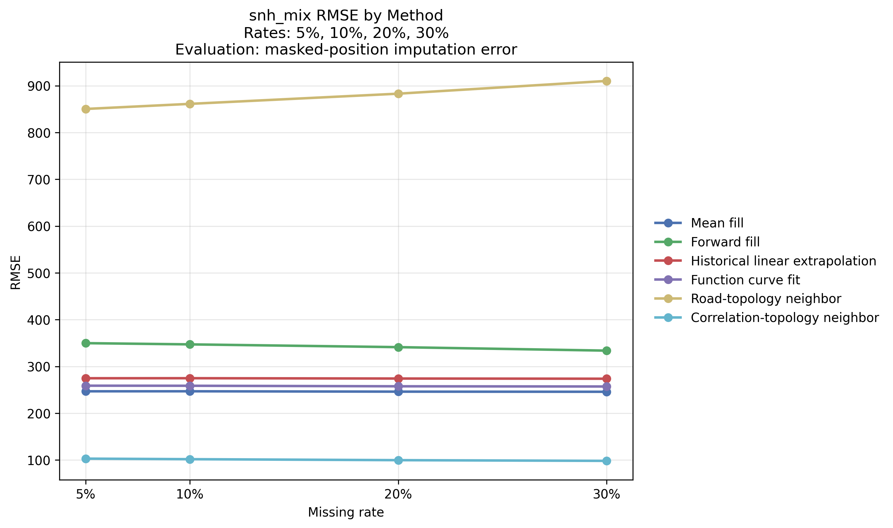
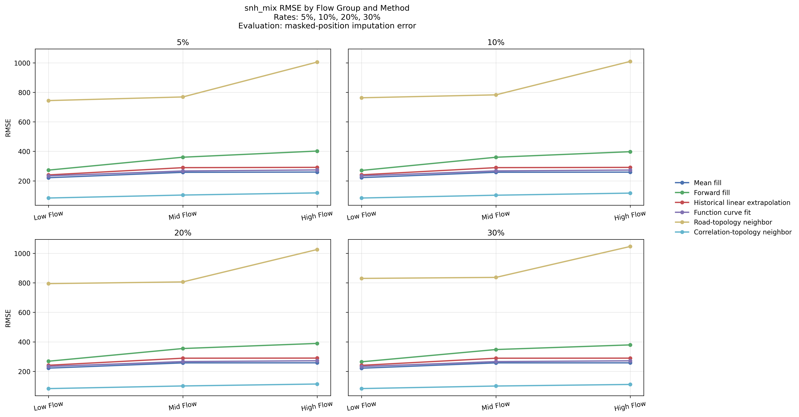
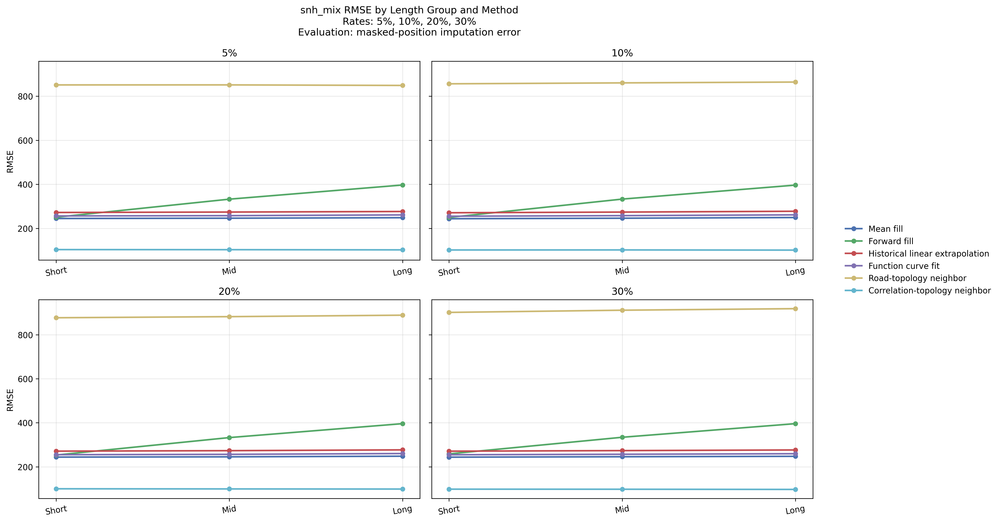
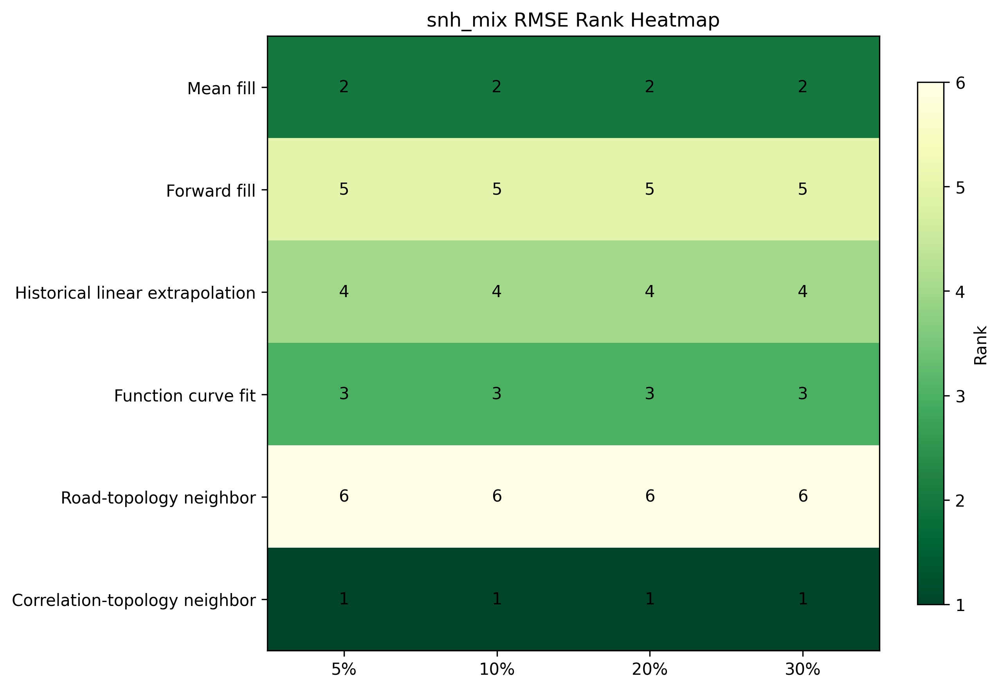

# 真实数据缺失设置与插补恢复实验

## 1. 引言

真实交通流分析通常建立在连续、稳定且可追溯的观测序列基础之上。然而，在实际采集链路中，传感器离线、通信中断、局部数据阻塞与空间节点可见性不均等因素会引入多类型缺失，从而影响后续预测模型的输入质量与统计结论的可靠性。已有研究普遍指出，缺失机制的结构特征将直接决定恢复难度与误差传播路径，因此在进入真实数据联邦预测分析之前，有必要对真实节点级交通流序列的缺失鲁棒性进行独立评估 [Ref-M1, Ref-M2]。

本节以项目已完成预处理的真实节点级交通流数据为基础，构造四类可复现缺失场景，并系统评估六种正式插补方法在不同缺失比例与不同信息边界下的恢复性能。与前述仿真实验聚焦标准 FedAvg 在受控 Non-IID 预测场景中的表现不同，本节关注的是输入数据层面的可恢复性，因此核心评价对象为掩码位置插补误差（masked-position imputation error），而非交通流预测误差。

本节的科学问题可以概括为三点。第一，在完整真实数据基线上，如何构造兼具可重复性、可审计性与机制解释性的缺失场景。第二，在严格历史因果约束与在线空间插补两类信息边界下，不同插补方法的性能差异如何表现。第三，这些恢复结果能否为后续真实数据预测实验提供上游数据质量证据，并与仿真实验中关于图结构、周期性和异质性的重要发现形成相互支撑 [Ref-F1, Ref-G1]。

需要说明的是，本文涉及四类正式场景：全局点级完全随机缺失（global MCAR point, `g_mcar_pt`）、节点连续时间块缺失（node temporal block, `ntb_mix`）、节点子集连续离线缺失（node subset temporal outage, `nso_mix`）以及空间邻居保留型目标节点连续缺失（spatial neighbor holdout, `snh_mix`）。其中，前三类场景共享严格历史因果补全协议，可放入统一主表比较；`snh_mix` 采用在线空间插补协议，允许使用当前时刻邻居观测，因此在正文中作为独立结果模块分析。该组织方式与仿真实验章节中“统一主线 + 专门结果分支”的写法保持一致，有利于章节迁移至 SCI 论文主体时维持逻辑连续性。

## 2. 材料与方法

### 2.1 数据基础与前序预处理衔接

本实验直接使用 `data\analysis\node_intersection_flow_parquet` 中的节点级交通流数据。该数据由原始路网文件、速度观测与派生交通指标经过清洗、聚合与节点映射后形成，覆盖 61 个日分片、42,031 个节点、每日 96 个时间片，总唯一观测对数为 246,133,536。预处理审计表明，基准数据中缺失记录、重复记录、空值、NaN 与负值均为 0，因此本节所有插补误差都建立在“完整真值可回溯”的前提下。

前序预处理模块已经验证观测节点与拓扑节点的一致性，这为道路拓扑邻接插补和相关性拓扑邻接插补提供了空间先验基础。同时，真实流量序列表现出的日内周期性也为历史均值、线性外推与函数曲线拟合等方法提供了统计支撑。因而，本节并非在原始脏数据上进行被动修复，而是在完整基准之上主动施加可控缺失，从而将恢复误差与真实值进行逐点比较。

### 2.2 问题定义与评价指标

设完整真实数据可表示为

$$
\mathcal{Y}=\{y_{d,n,t}\mid d\in\mathcal{D},\, n\in\mathcal{N},\, t\in\mathcal{T}\},
$$

其中 $d$ 表示日期索引，$n$ 表示节点索引，$t$ 表示日内时间片索引，且 $|\mathcal{T}|=96$。在给定缺失机制 $m$ 与目标缺失率 $r$ 的条件下，定义缺失掩码集合为 $\Omega_{m,r}$，其对应的观测集合为 $\mathcal{O}_{m,r}=\mathcal{Y}\setminus\Omega_{m,r}$。插补任务可记为构造函数

$$
\hat{y}_{d,n,t}=f_{\theta}(\mathcal{O}_{m,r},\mathcal{C}_{d,n,t}),
$$

其中 $\mathcal{C}_{d,n,t}$ 表示在协议边界内可访问的上下文信息。对于严格历史因果协议，$\mathcal{C}_{d,n,t}$ 仅包含目标节点过去 7 天及当日当前时刻之前的信息；对于在线空间插补协议，$\mathcal{C}_{d,n,t}$ 还允许包含当前时刻邻居节点观测，但不允许使用目标节点当前真实值或未来信息。

所有性能指标均仅在掩码位置上计算。设掩码位置总数为 $M$，真实值为 $y_i$，插补值为 $\hat{y}_i$，则主要评价指标定义为：

$$
\mathrm{MAE}=\frac{1}{M}\sum_{i=1}^{M}|y_i-\hat{y}_i|,
$$

$$
\mathrm{RMSE}=\sqrt{\frac{1}{M}\sum_{i=1}^{M}(y_i-\hat{y}_i)^2},
$$

$$
\mathrm{sMAPE}=\frac{1}{M}\sum_{i=1}^{M}\frac{2|y_i-\hat{y}_i|}{|y_i|+|\hat{y}_i|+\varepsilon},
$$

$$
\mathrm{NRMSE}=\frac{\mathrm{RMSE}}{y_{\max}-y_{\min}}.
$$

其中 $\varepsilon$ 为避免分母为零的极小常数。RMSE 与 MAE 作为主结果指标，sMAPE 与 NRMSE 用于辅助解释相对误差和跨场景尺度差异。由于目标变量为连续型交通流量，本节不引入 F1-score 等分类指标。

### 2.3 缺失场景设计

四类场景统一覆盖 5%、10%、20% 和 30% 四个目标缺失率，分别对应低、中、高缺失强度区间。场景设计兼顾统计学缺失机制、工程可复现性以及交通采集链路中的实际失效形态。

**表 1 四类缺失场景定义**

| 场景 ID | 中文名称 | 机制名称 | 信息边界 | 结构特征 | 在正文中的角色 |
|---|---|---|---|---|---|
| `g_mcar_pt` | 全局 MCAR 点级随机缺失 | global MCAR point | 严格历史因果 | 全局点级抽样，不形成连续块 | 统一主表场景 |
| `ntb_mix` | 节点连续时间块缺失 | node temporal block | 严格历史因果 | 单节点连续时间块，短中长混合 | 统一主表场景 |
| `nso_mix` | 节点子集连续离线缺失 | node subset temporal outage | 严格历史因果 | 部分节点在同一时段共同离线 | 统一主表场景 |
| `snh_mix` | 空间邻居保留型目标节点连续缺失 | spatial neighbor holdout | 在线空间插补 | 目标节点连续缺失，同时保留当前邻居观测 | 正文独立场景 |

`g_mcar_pt` 以单个 $(d,n,t)$ 观测为缺失单位，通过不放回抽样控制全局缺失计数，因此属于完全随机缺失（missing completely at random, MCAR）。`ntb_mix` 与 `nso_mix` 均采用 `mixed_short_mid_long` 事件长度模式，其中短块长度为 1-4、中块长度为 5-12、长块长度为 13-24 个时间片，采样概率分别为 0.4、0.4 和 0.2。二者均保留 `row_index` 级别掩码，只修改目标列，因此可用于掩码位置误差的精确统计。

两类结构化场景的差异在于缺失结构。`ntb_mix` 主要破坏单节点时间连续性，更接近单点采集链路的连续中断；`nso_mix` 表现为部分节点在同一时段共同离线，更接近局部区域设备故障或通信阻塞。`snh_mix` 则进一步放宽信息边界，使目标节点缺失时刻的邻居观测仍然可见，从而构成在线空间插补问题。

### 2.4 插补协议与方法集合

前三类主表场景遵循一致的严格历史因果协议：仅使用过去 7 天历史，设 `context_days_before = 7`、`context_days_after = 0`、`warmup_days = 7`，禁止 backfill、双向插值及未来信息访问。`snh_mix` 采用在线空间插补协议：允许使用当前时刻邻居观测，但同样禁止访问目标节点当前真实值以及未来时刻或未来日期的信息。

所有场景统一评估六种正式方法：

**表 2 插补方法及其方法学要点**

| 方法 | 英文名称 | 核心思想 | 主要依赖或退化路径 |
|---|---|---|---|
| `mean_fill` | Mean fill | 基于同节点同时间片与多级统计量的历史均值回填 | 历史统计均值链式退化 |
| `forward_fill` | Forward fill | 沿时间方向使用已有历史观测进行单向回填 | `previous_slot -> previous_day_last_slot` |
| `historical_linear_extrapolation` | Historical linear extrapolation | 利用历史序列趋势做线性外推 | 历史不足时退化为前向填充 |
| `function_curve_fit` | Function curve fit | 基于历史日曲线进行函数拟合恢复 | 历史 profile 不足时退化 |
| `road_topology_neighbor_fill` | Road-topology neighbor fill | 依据路网拓扑邻接和道路长度权重进行空间传播 | 无可用拓扑信息时退化 |
| `correlation_topology_neighbor_fill` | Correlation-topology neighbor fill | 结合拓扑邻接与正相关邻居观测估计缺失值 | 相关邻居不足时退化为均值法 |

需要指出的是，`correlation_topology_neighbor_fill` 在严格历史场景中依然遵守协议边界：其使用的是外部可观测邻居信息，而不是目标节点当前真值，因此并不构成目标泄漏。`snh_mix` 的特殊性仅在于协议本身允许当前邻居观测，从而使该方法的空间优势得到更充分体现。

### 2.5 实现环境、可复现性与工件一致性

实验环境和关键复现参数如下：

**表 3 实验环境与关键参数**

| 项目 | 配置 |
|---|---|
| 操作系统 | Windows |
| Shell | PowerShell `5.1.19041.1682` |
| Python 环境 | conda `analysis` |
| Python | `3.9.23` |
| 核心依赖 | `numpy`、`pandas`、`pyarrow`、`scipy`、`matplotlib` |
| 输入目录 | `data\analysis\node_intersection_flow_parquet` |
| 拓扑文件 | `data\processed\rnsd_processed.csv` |
| 目标列 | `路口车流量` |
| 节点列 | `节点ID` |
| 时间列 | `时间段` |
| 日内周期 | `96` |
| 随机种子 | `42` |
| 历史窗口 | `7` 天 |
| warmup | `7` 天 |

上述环境口径与项目现有运行记录保持一致。真实数据缺失设置与插补脚本的示例命令、场景目录下的 `run_commands*.txt` 以及项目环境说明文档均指向 `E:\anaconda3\envs\analysis\python.exe`，因此本节后续涉及的复现实验环境统一以 conda `analysis` 为准。

从实现链路上看，`global_missingness_setting_pipeline.py`、`structured_missingness_setting_pipeline.py` 与 `spatial_neighbor_holdout_setting_pipeline_fast.py` 分别负责四类场景的缺失生成；`global_missingness_imputation_pipeline.py`、`structured_missingness_imputation_pipeline.py` 与 `spatial_neighbor_holdout_imputation_pipeline.py` 负责方法执行与 summary 输出；`visualize_all_missingness_imputation_results.py` 和 `visualize_spatial_neighbor_holdout_results.py` 负责结果图件；`repair_structured_scenario_artifacts.py`、`analyze_structured_missingness_distribution.py` 与相关测试脚本负责结构化工件的一致性修复与回归验证。该模块化结构保证了结果的可追溯性与后续复核便利性。

此外，先前 `nso_mix/ntb_mix` 目录中由共享工件复制引起的 `manifest` 与分布报告错位问题已完成修复，并通过一致性校验文件验证为 `all_consistent = true`。因此，本节引用的结构化场景统计已具备归档与论文使用的基础一致性。

### 2.6 图表与引用规范说明

为满足 SCI 期刊常见排版要求，本节采用以下写法规范。第一，专业术语在首次出现时给出中英文对应，如完全随机缺失（missing completely at random, MCAR）和在线空间插补（online spatial interpolation）。第二，所有图表均采用“表题在上、图题在下”的标准结构，正文中统一使用 `Figure 1`、`Figure 2` 的连续编号格式。第三，嵌入正文的图件使用现有 PNG 版本以保证在线阅读与文档排版兼容，同时各图对应的 PDF 矢量版本保留在结果目录中，可在投稿排版阶段直接替换为出版级源文件。第四，文中引用框架预留为 `[Ref-*]` 形式，以便后续并入论文总参考文献列表时统一编号。第五，图表编号在迁移到论文主体后可按全稿顺序重排，但本节内部编号、图注与正文引导关系已经按照独立章节标准完成统一。

## 3. 结果

### 3.1 严格历史协议场景的总体结果

在统一主表覆盖的三类严格历史协议场景中，`correlation_topology_neighbor_fill` 在四个缺失率水平上均取得最低 RMSE。该结论直接来自场景级正式 summary，而非后验排序结果。

**表 4 三类严格历史协议场景在不同缺失率下的最优整体结果（按 RMSE）**

| 场景 | 缺失率 | 最优方法 | MAE | RMSE | sMAPE | NRMSE |
|---|---:|---|---:|---:|---:|---:|
| `g_mcar_pt` | 5% | `correlation_topology_neighbor_fill` | 45.1552 | 110.7937 | 0.03145 | 0.01062 |
| `g_mcar_pt` | 10% | `correlation_topology_neighbor_fill` | 47.1205 | 115.8953 | 0.03225 | 0.01107 |
| `g_mcar_pt` | 20% | `correlation_topology_neighbor_fill` | 52.1711 | 129.1339 | 0.03449 | 0.01234 |
| `g_mcar_pt` | 30% | `correlation_topology_neighbor_fill` | 58.4305 | 143.8741 | 0.03726 | 0.01374 |
| `ntb_mix` | 5% | `correlation_topology_neighbor_fill` | 45.1405 | 110.2810 | 0.03140 | 0.01054 |
| `ntb_mix` | 10% | `correlation_topology_neighbor_fill` | 47.1376 | 115.7931 | 0.03218 | 0.01106 |
| `ntb_mix` | 20% | `correlation_topology_neighbor_fill` | 52.8865 | 131.5119 | 0.03445 | 0.01256 |
| `ntb_mix` | 30% | `correlation_topology_neighbor_fill` | 59.8567 | 148.5163 | 0.03752 | 0.01419 |
| `nso_mix` | 5% | `correlation_topology_neighbor_fill` | 45.0902 | 110.3261 | 0.03135 | 0.01053 |
| `nso_mix` | 10% | `correlation_topology_neighbor_fill` | 47.1929 | 116.2455 | 0.03236 | 0.01110 |
| `nso_mix` | 20% | `correlation_topology_neighbor_fill` | 52.1823 | 129.1213 | 0.03448 | 0.01232 |
| `nso_mix` | 30% | `correlation_topology_neighbor_fill` | 58.4905 | 144.1964 | 0.03729 | 0.01378 |

三个场景均表现出一致的误差增长趋势：随着缺失率由 5% 提升至 30%，最优 RMSE 从约 110 增长至 144-149 区间。这表明缺失比例仍是决定恢复难度的首要因素。值得注意的是，`ntb_mix` 在高缺失率区间的最优 RMSE 略高于 `g_mcar_pt` 与 `nso_mix`，说明单节点长时间连续空洞对仅依赖历史信息的恢复机制更不友好。

### 3.2 代表性方法差异与结构长度敏感性

为了进一步说明方法层面的差异，表 5 给出 5% 缺失率下三类严格历史协议场景的代表性 RMSE 比较。

**表 5 5% 缺失率下代表性方法的 RMSE 对比**

| 场景 | `forward_fill` | `mean_fill` | `function_curve_fit` | `historical_linear_extrapolation` | `road_topology_neighbor_fill` | `correlation_topology_neighbor_fill` |
|---|---:|---:|---:|---:|---:|---:|
| `g_mcar_pt` | 181.8151 | 250.9490 | 257.7133 | 317.9375 | 855.2229 | 110.7937 |
| `ntb_mix` | 355.3231 | 250.5986 | 257.8246 | 317.0631 | 855.1867 | 110.2810 |
| `nso_mix` | 233.5330 | 250.0624 | 256.8544 | 316.6989 | 854.5850 | 110.3261 |

这一结果揭示出两个稳定现象。首先，`correlation_topology_neighbor_fill` 的优势并非边际改进，而是与其他方法形成明显的误差间隔，说明“拓扑邻接 + 同时刻正相关约束”能够有效利用真实空间依赖。其次，`road_topology_neighbor_fill` 在三类严格历史协议场景中均明显落后，提示静态拓扑先验若缺少可用的相关观测支撑，难以独立承担高质量恢复任务。

对于结构化场景，缺失长度也是关键因素。表 6 汇总了 30% 缺失率下的长度组最优结果。

**表 6 30% 缺失率下结构化场景长度组最优结果（按 RMSE）**

| 场景 | 长度组 | 最优方法 | MAE | RMSE | sMAPE |
|---|---|---|---:|---:|---:|
| `ntb_mix` | short | `correlation_topology_neighbor_fill` | 59.0170 | 145.8108 | 0.03728 |
| `ntb_mix` | mid | `correlation_topology_neighbor_fill` | 59.8084 | 148.3204 | 0.03757 |
| `ntb_mix` | long | `correlation_topology_neighbor_fill` | 60.3449 | 150.1257 | 0.03742 |
| `nso_mix` | short | `correlation_topology_neighbor_fill` | 58.4600 | 144.1134 | 0.03728 |
| `nso_mix` | mid | `correlation_topology_neighbor_fill` | 58.9187 | 145.5397 | 0.03732 |
| `nso_mix` | long | `correlation_topology_neighbor_fill` | 60.0366 | 148.0914 | 0.03813 |

随着缺失块长度增加，误差总体上升，且这一趋势在 `ntb_mix` 中更加显著。这说明当缺失主要沿单节点时间轴连续扩展时，目标节点自身历史对恢复的支撑能力下降更快；相比之下，`nso_mix` 的长度效应较为平缓，表明部分节点共同离线场景仍保留一定的空间同构结构。

### 3.3 `snh_mix` 场景的在线空间插补结果

与前三类严格历史协议场景不同，`snh_mix` 允许使用目标节点缺失时刻的邻居观测，因此应在独立协议框架下解释其结果。该场景的正式 summary 显示，`correlation_topology_neighbor_fill` 在四个缺失率下均取得最低 RMSE。

**表 7 `snh_mix` 在不同缺失率下的最优整体结果（按 RMSE）**

| 缺失率 | 最优方法 | MAE | RMSE | sMAPE | NRMSE | 第二优方法 |
|---|---|---:|---:|---:|---:|---|
| 5% | `correlation_topology_neighbor_fill` | 41.9985 | 102.9707 | 0.03009 | 0.00991 | `mean_fill` |
| 10% | `correlation_topology_neighbor_fill` | 41.2417 | 101.7887 | 0.03027 | 0.00975 | `mean_fill` |
| 20% | `correlation_topology_neighbor_fill` | 39.9806 | 99.6925 | 0.03069 | 0.00952 | `mean_fill` |
| 30% | `correlation_topology_neighbor_fill` | 39.0055 | 98.1955 | 0.03128 | 0.00940 | `mean_fill` |

在 `snh_mix` 中，最优 RMSE 稳定维持在 98-103 区间，且随缺失率提升并未表现出与前三类严格历史协议场景相同的显著恶化。这一结果表明，当当前时刻邻居观测可用时，空间相关信息可以显著增强恢复能力。不过，这一结论不能与前三类场景直接做数值强比较，因为二者的信息边界并不相同。

### 3.4 严格历史协议场景的可视化证据

为了与表 4 至表 6 的量化结果形成互补，本节首先给出三类严格历史协议场景的单场景与跨场景可视化结果。该部分图件的目标是展示误差曲线的整体形态、方法间间隔以及场景间难度层级，从而为后文的 `snh_mix` 在线空间插补图件提供统一参照。

如 Figure 1 所示，在 `g_mcar_pt` 场景下，`correlation_topology_neighbor_fill` 在 5%-30% 缺失率区间始终保持最低 RMSE，而 `road_topology_neighbor_fill` 的误差水平持续处于最差区间，说明单纯依赖静态拓扑而缺少实时相关邻居支撑时，点级随机缺失恢复能力明显不足。

Figure 1. RMSE comparison of six imputation methods under the `g_mcar_pt` scenario. The horizontal axis denotes the target missing rate, and the vertical axis denotes RMSE. `g_mcar_pt` corresponds to global point-wise MCAR missingness. RMSE, root mean square error; MCAR, missing completely at random.

如 Figure 2 所示，`ntb_mix` 场景中的方法分离度进一步增大，尤其是纯时间插补方法在高缺失率区间的误差上升更快。这一结果与表 6 的长度组分析一致，说明连续时间块缺失会显著削弱单节点历史信息的可恢复性。

Figure 2. RMSE comparison of six imputation methods under the `ntb_mix` scenario. `ntb_mix` denotes node temporal block missingness with mixed short-, mid-, and long-span outages. The larger separation among methods at higher missing rates indicates stronger sensitivity of temporally continuous missing blocks to the chosen imputation strategy. RMSE, root mean square error.

如 Figure 3 所示，`nso_mix` 场景的整体趋势与 `ntb_mix` 相近，但在低至中等缺失率区间的若干时间型方法差距略有收敛；即便如此，`correlation_topology_neighbor_fill` 依然维持稳定领先，提示局部节点集合共同离线时仍存在可利用的空间同构结构。

Figure 3. RMSE comparison of six imputation methods under the `nso_mix` scenario. `nso_mix` denotes node subset temporal outage, in which a subset of nodes becomes jointly unavailable within the same period. The figure shows that correlation-aware topology neighbors remain consistently advantageous even when the missingness pattern is spatially clustered. RMSE, root mean square error.

为了进一步比较三类严格历史协议场景的整体难度层级，Figure 4 汇总了跨场景总体 RMSE 结果。该图并不替代表 5 的场景级最优结果，而是用于从整体趋势上说明三类场景对方法性能的共同影响方向。

Figure 4. Cross-scenario overall RMSE comparison among the three strict-history protocol scenarios, namely `g_mcar_pt`, `ntb_mix`, and `nso_mix`. The figure is intended to visualize scenario-level difficulty differences under a unified causal-history constraint, while formal quantitative conclusions remain based on the scenario summaries reported in Table 4. RMSE, root mean square error.

### 3.5 `snh_mix` 场景的完整可视化结果

鉴于 `snh_mix` 已被界定为正文中的正式结果模块，本节补充嵌入其具有明确业务用途的核心图件，以形成“总体性能图 + 分组稳健性图 + 排名热图”的完整证据链。与前三类严格历史协议场景不同，以下图件均应解释为在线空间插补协议下的方法比较，而不能直接视为与 Figure 1-Figure 4 同口径的统一排名。考虑到表 7 已经同时报告 MAE、sMAPE 与 NRMSE 数值结果，正文中不再重复嵌入仅改变误差量纲但不新增业务信息的冗余曲线，而将有限图幅集中用于支撑方法优劣、流量分层稳健性与缺失跨度稳健性三类核心问题。

首先，Figure 5 给出了 `snh_mix` 场景的总体 RMSE 曲线。与表 7 的最优结果一致，`correlation_topology_neighbor_fill` 在四个缺失率水平上始终取得最低 RMSE，且误差变化范围明显低于前三类严格历史协议场景。

Figure 5. RMSE comparison of six imputation methods under the `snh_mix` scenario. `snh_mix` denotes spatial neighbor holdout missingness, where the target node is masked while same-time neighbor observations remain visible. The figure highlights the strong advantage of correlation-aware topology neighbors under the online spatial interpolation protocol. RMSE, root mean square error.

仅有总体指标仍不足以说明 `snh_mix` 在不同业务子群上的表现，因此 Figure 6 和 Figure 7 分别给出按流量水平与按缺失长度分组的 RMSE 结果。Figure 6 表明，在高流量、中流量和低流量三个预定义流量层中，最优方法的领先关系保持稳定，说明在线空间插补优势并不局限于某一流量范围。

Figure 6. RMSE comparison by flow group under the `snh_mix` scenario. High-flow, mid-flow, and low-flow groups denote the predefined traffic-level strata in the formal summary. The figure shows that `correlation_topology_neighbor_fill` maintains its advantage across heterogeneous traffic-intensity subsets. RMSE, root mean square error.

如 Figure 7 所示，从缺失跨度角度观察时，`correlation_topology_neighbor_fill` 在 short、mid 和 long 三类缺失长度组中始终排名第一，与表 7 中的总体最优结论形成一致支持。这里的 short、mid 和 long 分别对应 1-4、5-12 和 13-24 个时间片的预定义缺失长度区间。

Figure 7. RMSE comparison by missing-length group under the `snh_mix` scenario. Short, mid, and long correspond to missing spans of 1-4, 5-12, and 13-24 time steps, respectively. The ranking stability across length groups indicates that the performance gain of correlation-aware topology neighbors is robust to the duration of contiguous target-node missingness. RMSE, root mean square error.

最后，Figure 8 以排名热图的形式汇总了 `snh_mix` 在不同缺失率下的 RMSE 排名结果，使方法优势的全局结构更易于比较。该图能够直观显示 `correlation_topology_neighbor_fill` 在全部缺失率水平上的一致第一名地位，以及其他方法在不同条件下的相对排序波动。

Figure 8. Heatmap of RMSE-based method rankings under the `snh_mix` scenario across all missing-rate levels. Lower ranks indicate better performance, with rank 1 representing the best method at the corresponding missing rate. The heatmap summarizes the globally stable dominance of `correlation_topology_neighbor_fill` under the online spatial interpolation protocol. RMSE, root mean square error.

## 4. 讨论

### 4.1 图相关空间信息为何稳定有效

无论在严格历史协议场景还是在线空间插补场景中，`correlation_topology_neighbor_fill` 都表现出稳定优势。这一现象说明，真实交通流恢复并不仅仅依赖时间平滑性，还依赖空间上可解释的相关结构。与单纯使用静态拓扑不同，相关性拓扑策略能够在空间邻接关系之上进一步筛选信息质量更高的邻居节点，从而降低无效传播和误差放大风险。这一点与仿真实验中“图结构建模优于规则卷积建模”的趋势形成了方法论上的相互印证 [Ref-G1, Ref-G2]。

### 4.2 缺失机制与信息边界共同决定恢复难度

本节结果表明，缺失率、缺失结构和可用信息边界共同决定恢复性能。前三类严格历史协议场景共享同样的可用信息约束，因此适合纳入统一主表比较；在这一前提下，`ntb_mix` 的高缺失率结果略差于 `g_mcar_pt` 和 `nso_mix`，说明长时间连续空洞更依赖目标节点自身历史。另一方面，`snh_mix` 的较低误差并不意味着该场景在统计意义上“更简单”，而是因为其当前时刻邻居信息可用，从根本上改变了恢复问题的信息结构。因此，将 `snh_mix` 作为独立正文模块而非与前三类统一排名，是更符合 SCI 论文方法学严谨性的写法。

### 4.3 学术适配性与章节独立性

从章节组织上看，本节已经具备 SCI 论文独立章节所需的基本要素：明确的引言、可复现的方法定义、公式化指标体系、结构化结果展示、讨论性解释以及可继续扩展的引用框架。与参考仿真实验章节相同，本节保持了“问题定位 -> 方法定义 -> 结果证据 -> 讨论归纳”的学术叙述路径；同时，图表、术语和公式写法均可在并入整篇论文后进行全局编号，而无需对核心内容进行二次重构。

此外，结构化工件一致性问题已经完成修复，使 `nso_mix` 与 `ntb_mix` 的 `manifest`、分布摘要和审计结果能够为本节提供稳定支撑。这一点对 SCI 写作尤为重要，因为章节一旦进入正文，就必须保证其结果链条具有一致性、可复核性与可再现性。

## 5. 结论

本节在完整真实节点级交通流基线之上，构造了四类可复现缺失场景，并系统评估六种正式插补方法在严格历史因果补全与在线空间插补两类协议下的表现。主要结论如下。

1. 在三类严格历史协议场景中，`correlation_topology_neighbor_fill` 在全部缺失率水平下均取得最低整体 RMSE，说明相关拓扑邻居信息是恢复真实交通流缺失值的关键线索。
2. 随着缺失率提升，`g_mcar_pt`、`ntb_mix` 和 `nso_mix` 的误差均稳定上升，表明缺失比例仍是决定恢复难度的核心因素。
3. 相较于全局点级随机缺失，单节点连续时间块缺失在高缺失率下表现出更高恢复难度，说明结构化连续缺失会显著削弱历史信息的有效性。
4. 在 `snh_mix` 场景中，`correlation_topology_neighbor_fill` 的 RMSE 稳定维持在 98.20-102.97 区间，表明当前时刻邻居观测在在线空间插补协议下具有显著增益。
5. 本节结果与前述仿真实验关于图结构和异质性重要性的发现具有方向一致性，但二者分别对应数据恢复与预测建模两个层面，因此应当被理解为互补证据，而非简单替代关系。

未来工作可沿三个方向推进：其一，将当前最优插补方案与真实数据联邦预测实验直接连接，定量分析输入恢复质量改善对下游预测收益的贡献；其二，在现有 MCAR 与结构化非随机缺失之外，引入更明确的 MAR 或设备级故障机制建模；其三，继续丰富 `snh_mix` 所代表的在线空间插补类实验，包括更细粒度的邻居约束诊断与自适应空间方法扩展。
