# 仿真实验与机制性验证

## 仿真实验定位与设计目标

在正式论文结构中，`Synthetic Experiments` 位于 `Data analysis` 章节之下，并先于 `Real-World Data Analysis` 展开。因而，仿真实验的职责应限定为受控条件下的机制性验证：其一，检验标准 FedAvg 联邦训练框架在交通流预测任务中的有效性、收敛性与鲁棒性；其二，为后续真实交通数据分析提供方法学铺垫，而不是提出新的联邦聚合算法。基于这一定位，本文在仿真实验模块中继续坚持“标准 FedAvg 为唯一联邦聚合主线，Independent 为非协同基线”的写作口径。

除标准 FedAvg 外，研究过程中还考察过若干探索性加权策略，如 `Proposed`、`Loss-weighted` 与 `Data-loss weighted`。本文正文仅围绕标准 FedAvg 展开分析，上述探索性策略不纳入主文核心结论。仿真实验的分析重点集中于 Non-IID 分层、客户端数量扩展、特征消融、鲁棒性分析以及 GCN 固定图与动态图对比等内容，以形成围绕标准 FedAvg 的完整证据链。

为降低单次实验随机性对结论的影响，本文在基础 CNN、基础 GCN、增强异质性场景和联邦扰动场景中引入五个随机种子进行重复实验，并以均值和标准差形式报告主要指标。多随机种子设置用于降低随机初始化、本地训练过程与扰动机制对实验结果的影响，从而增强实验结论的稳定性与可复现性。

## 仿真数据构造、客户端划分与 Non-IID 设置

基础 CNN 与基础 GCN 实验采用一致的数据生成框架。基础场景包含 5 个客户端、8 个交通节点、长度为 24 的输入窗口和 1 步预测步长，训练集、验证集和测试集划分比例为 70%/10%/20%。与理想化同构设置不同，基础仿真数据集引入了轻度样本量不平衡和受控客户端差异：五个客户端的样本量分别为 190、210、180、220 和 200，同时在流量水平、高峰强度、相位偏移和观测噪声方面设置轻微差异，从而构造弱异质性的联邦交通预测场景。该设计既避免了过度理想化的数据假设，也与增强仿真中的强 Non-IID 设置形成区分。

增强 CNN 实验采用更复杂的客户端异构环境。五个客户端分别对应正态、Student-t、卡方、高斯混合和对数正态扰动机制，样本规模依次为 600、500、700、550 和 450，且噪声水平、基础流量、高峰参数与事件扰动存在差异。因此，增强实验中的 Non-IID 不仅体现为样本量不平衡，也体现为分布族、噪声强度和场景事件的联合异构。这一设定更贴近跨区域交通监测中常见的客户端差异。

基础 GCN 实验显式给出了合成路网结构。图结构统计结果显示，基础图包含 8 个节点、10 条边，图密度为 0.3571，平均度为 2.5。增强 GCN 实验进一步给出了固定图与动态图的统计属性，其中固定图平均权重为 0.2188，而动态图在早高峰、晚高峰和平峰条件下的图密度均提升至 0.875，平均边权约在 0.786 至 0.831 之间。这些设定使 GCN 路径不仅承担空间结构建模的职责，也为后续动态图分析提供了独立证据。

在增强异质性场景中，本文进一步从 Non-IID 程度、客户端数量和输入特征组合三个角度分析 FedAvg 的预测表现。该设计使仿真实验不仅能够验证基础联邦训练效果，还能够考察客户端异构性、参与规模和特征配置变化对标准 FedAvg 的影响。核心主结果、收敛结果和鲁棒性结果统一采用五个随机种子 `42`、`2024`、`3407`、`1234` 和 `5678` 进行重复验证；固定图与动态图比较图仍主要用于呈现趋势性结果，因此相关结论应保持审慎。

两张数据集说明图采用一致的子图顺序，分别从客户端样本量、平均交通流轨迹、目标流量分布和异质性摘要/驱动因素四个角度展示基础场景与增强场景的差异。
为更直观地说明仿真数据的构造逻辑，图 1 给出了基础仿真数据集构造示意图。基础仿真数据集用于在轻度样本量不平衡、空间结构一致和输入输出设置一致的条件下，验证 FedAvg 的基本协同建模能力；与此同时，各客户端平均交通流轨迹和目标流量分布保留可观察但受控的轻微差异，以构成受控弱异质性的联邦场景。

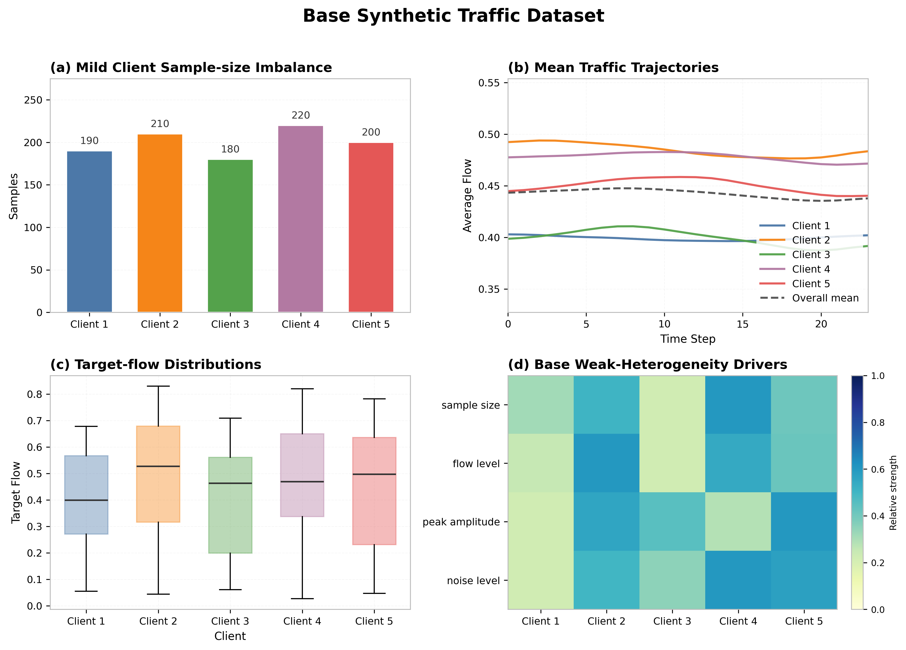

注：图 1 展示了基础仿真交通流数据集的构造特征。该数据集在节点规模和输入输出设置上保持一致，同时引入轻度样本量不平衡以及可观察但受控的流量水平差异、高峰强度差异、相位偏移和噪声差异。图中的弱异质性驱动因素热力图用于展示不同客户端之间相对温和的异质性强度。

图 2 给出了增强仿真数据集的 Non-IID 构造示意图。增强仿真数据集用于模拟样本量不平衡、分布族差异、噪声差异、高峰模式差异和事件扰动共同作用下的 Non-IID 联邦交通预测环境，从而更接近跨区域交通监测中的客户端异构场景。

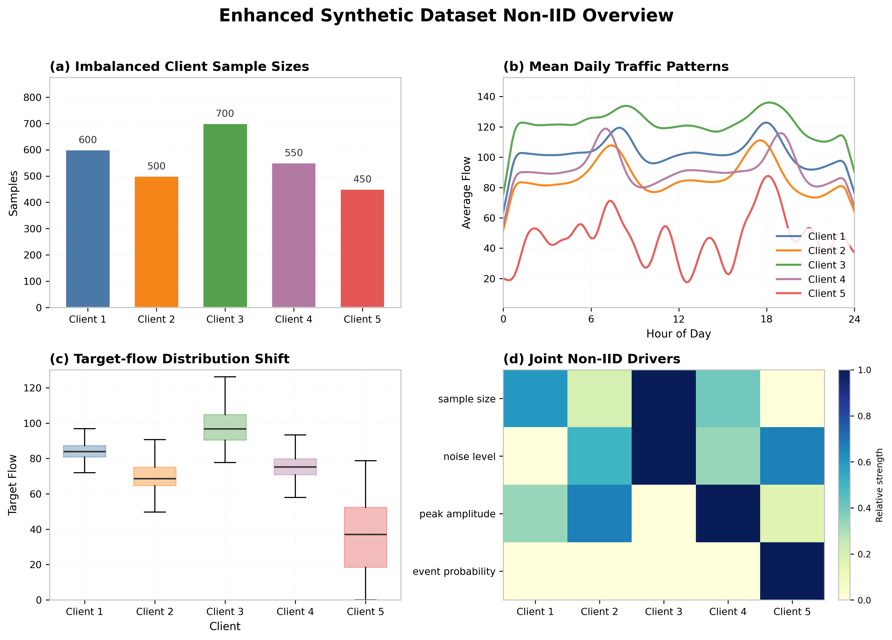

注：图 2 展示了增强仿真数据集中的 Non-IID 构造方式。与基础数据集相比，增强数据集进一步引入更明显的样本量不平衡、分布偏移、噪声水平差异、高峰模式差异和事件扰动。图中的 Non-IID 驱动因素热力图用于展示不同客户端在多种异质性来源上的相对强度差异。

## FedAvg 联邦训练流程与评价指标

本文仿真实验严格采用标准 FedAvg 聚合。设第 $t$ 轮服务器下发的全局模型参数为 $\mathbf{w}^{t}$，第 $k$ 个客户端本地训练后返回的参数为 $\mathbf{w}_{k}^{t+1}$，其样本量为 $n_k$，则服务器端聚合更新写为：

$$
\mathbf{w}^{t+1}
=
\sum_{k=1}^{K}
\frac{n_k}{\sum_{j=1}^{K} n_j}
\mathbf{w}_{k}^{t+1}
$$

客户端 $k$ 的本地目标函数可写为：

$$
\mathcal{L}_k(\mathbf{w})
=
\frac{1}{n_k}
\sum_{i=1}^{n_k}
\ell(\mathbf{w}; x_i^k, y_i^k)
$$

其本地 SGD 更新形式为：

$$
\mathbf{w}_k
\leftarrow
\mathbf{w}_k
- \eta \nabla \mathcal{L}_k(\mathbf{w}_k)
$$

上述三式定义了全文统一的联邦训练主线。需要说明的是，任何基于损失加权、数据损失加权或自定义质量权重的聚合方式都不作为本文方法论的组成部分。论文的研究重点在于将标准 FedAvg 框架用于多区域交通流预测，并分析其在 CNN 与 GCN 两类时空模型下的表现，而不在于提出新的联邦聚合算法。

FedAvg 联邦交通流预测训练流程如下。

算法 1：FedAvg 联邦交通流预测训练流程

1. 服务器初始化全局模型参数 `w^0`。
2. 在每一轮通信开始时，服务器将全局模型广播至所有参与客户端。
3. 各客户端以收到的全局模型作为本地模型初值，并在本地数据集上执行若干轮 mini-batch SGD 更新。
4. 本地训练结束后，各客户端上传更新后的参数 `w_k^{t+1}`。
5. 服务器依据各客户端样本量执行 FedAvg 聚合，得到新的全局模型 `w^{t+1}`。
6. 重复上述过程直至达到设定通信轮次，并输出最终全局模型。

评价指标统一采用 MSE、RMSE、MAE 与 MAPE，用于衡量平方误差、均方根误差、绝对误差以及相对误差水平。本文主表采用这四项指标，以保证基础实验、增强实验、鲁棒性实验与 GCN 动态图分析之间的指标一致性。同时，多随机种子统计结果中补充记录 `R²`，用于辅助观察模型对目标序列方差的解释能力。考虑到不同实验设置下数据尺度可能存在差异，`R²` 仅作为辅助指标，并与 RMSE、MAE、MAPE 及收敛趋势共同用于综合分析。

## 时空预测模型结构

### CNN-BiLSTM-Attention

CNN 路径将局部空间依赖表示为规则邻域上的卷积编码，再通过 BiLSTM 建模时间演化，并以 Attention 融合空间与时间表征。若以 $M_{i,t}$ 表示客户端局部空间邻域输入，则卷积式空间编码可写为：

$$
H_{i,t}^{(m)}
=
\sigma \left( W^{(m)} * M_{i,t} + b^{(m)} \right)
$$

上述结构说明在规则节点布局较清晰的合成场景中，卷积编码能够稳定提取局部空间模式。

### GCN-BiLSTM-Attention

GCN 路径将交通系统表示为图结构，通过图卷积传播节点间的拓扑依赖。设 $X_t$ 为时刻 $t$ 的节点特征矩阵，$\tilde{A}=A+I$ 为加自环后的邻接矩阵，$\tilde{D}$ 为对应度矩阵，则图卷积可写为：

$$
H_t
=
\sigma
\left(
\tilde{D}^{-\frac{1}{2}}
\tilde{A}
\tilde{D}^{-\frac{1}{2}}
X_t
W
\right)
$$

GCN 的价值在于将显式道路连通关系纳入局部模型内部，而不是改变联邦聚合规则。因此，CNN 与 GCN 两条路径在本文中承担的是不同空间建模思路下对标准 FedAvg 的互补验证。

## 基础联邦实验结果

### CNN-FedAvg 与 Independent 对比

五随机种子结果显示，在 CNN 基础实验中，FedAvg 的 RMSE、MAE 和 MAPE 分别为 `0.0658 ± 0.0031`、`0.0538 ± 0.0033` 和 `5.3776 ± 0.3263`；Independent 的对应指标为 `0.0860 ± 0.0081`、`0.0730 ± 0.0078` 和 `7.2964 ± 0.7784`。该结果表明，在轻度样本量不平衡、空间结构一致且仅保留弱异质性的基础场景中，FedAvg 相较独立训练仍能稳定降低总体误差，说明跨客户端协同建模能够在受控弱异质性条件下形成有效收益。

**表 1 仿真实验设置表**

| 项目 | CNN 基础实验 | GCN 基础实验 | CNN 增强实验 | GCN 增强实验 | 鲁棒性实验 |
|---|---|---|---|---|---|
| 客户端数量 | 5 | 5 | 默认 5，另含 3/5/8 客户端设计 | 5 | 5 |
| 节点数量 | 8 | 8 | 8 | 8 | 继承增强数据 |
| 时间窗口 | 24 | 24 | 12 | 12 | 12 |
| 预测步长 | 1 | 1 | 1 | 1 | 1 |
| 训练/验证/测试 | 70% / 10% / 20% | 70% / 10% / 20% | 70% / 10% / 20% | 继承增强数据划分 | 继承增强数据划分 |
| 每客户端样本 | 190 / 210 / 180 / 220 / 200 | 190 / 210 / 180 / 220 / 200 | 600/500/700/550/450 | 与增强数据一致 | 与增强数据一致 |
| 通信轮次 | 主训练 10；收敛记录 15 | 10 | 5 | 4 | 3 |
| 本地 epoch | 3 | 3 | 2 | 1 | 1 |
| batch size | 16 | 16 | 32 | 继承增强实现 | 继承增强实现 |
| 随机种子 | 42、2024、3407、1234、5678 | 42、2024、3407、1234、5678 | 核心统计采用 42、2024、3407、1234、5678；部分趋势图对应单种子结果 | 核心统计采用 42、2024、3407、1234、5678；固定图/动态图比较主要用于趋势分析 | 42、2024、3407、1234、5678 |

**表 2 CNN 基础实验五随机种子结果**

| 方法 | RMSE | MAE | MAPE | R² | 结果说明 |
|---|---:|---:|---:|---:|---|
| FedAvg | 0.0658 ± 0.0031 | 0.0538 ± 0.0033 | 5.3776 ± 0.3263 | 0.8786 ± 0.0138 | 主要误差指标更低 |
| Independent | 0.0860 ± 0.0081 | 0.0730 ± 0.0078 | 7.2964 ± 0.7784 | 0.7867 ± 0.0444 | 整体误差更高 |

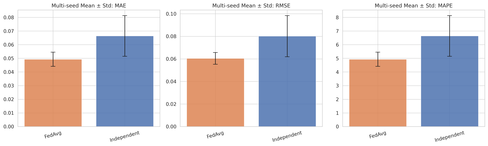

注：图 3 给出了 CNN-FedAvg 在五个随机种子下的主指标均值与标准差，用于展示不同随机初始化条件下模型预测结果的波动范围。

### GCN-FedAvg 与 Independent 对比

五随机种子结果显示，在 GCN 基础实验中，FedAvg 的 RMSE、MAE 和 MAPE 分别为 `0.0561 ± 0.0023`、`0.0460 ± 0.0028` 和 `4.5983 ± 0.2829`；Independent 的对应指标为 `0.0950 ± 0.0093`、`0.0810 ± 0.0094` 和 `8.0990 ± 0.9383`。该结果说明，在显式图结构输入下，FedAvg 相较独立训练同样表现出更低的整体误差，而且这一优势在轻度样本量不平衡的弱异质性基础场景中更加稳定。

**表 3 GCN 基础实验五随机种子结果**

| 方法 | RMSE | MAE | MAPE | R² | 结果说明 |
|---|---:|---:|---:|---:|---|
| FedAvg | 0.0561 ± 0.0023 | 0.0460 ± 0.0028 | 4.5983 ± 0.2829 | 0.9110 ± 0.0114 | 整体误差更低且更稳定 |
| Independent | 0.0950 ± 0.0093 | 0.0810 ± 0.0094 | 8.0990 ± 0.9383 | 0.7371 ± 0.0554 | 整体误差更高 |

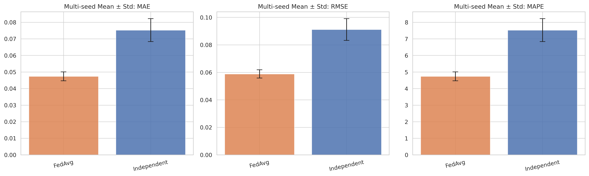

注：图 4 给出了 GCN-FedAvg 在五个随机种子下的主指标均值与标准差，用于展示图结构建模条件下模型误差及其波动范围。

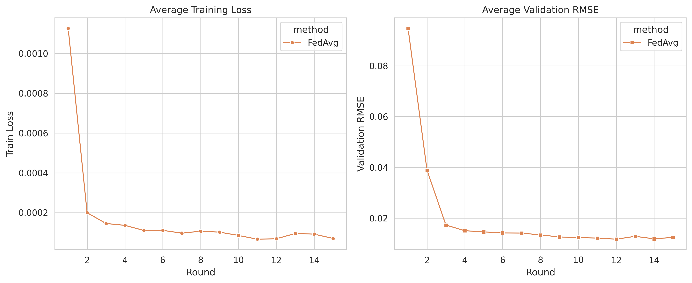

注：图 5 展示了 CNN-FedAvg 在通信轮次推进过程中的验证误差变化趋势。

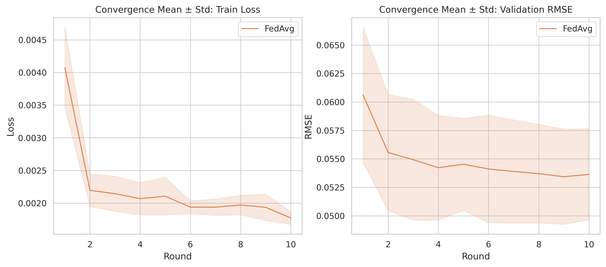

注：图 6 展示了 GCN-FedAvg 在通信轮次推进过程中的验证误差变化趋势。

### CNN 与 GCN 路径对比

五随机种子统计结果显示，GCN-FedAvg 在 RMSE、MAE 和 MAPE 上均低于 CNN-FedAvg，且标准差更小，说明图结构建模在当前弱异质性基础场景中具有更稳定的统计表现。与此同时，CNN 路径在规则局部空间结构中仍具有较明确的归纳偏置，因此两类结构可以作为标准 FedAvg 下的互补空间建模路径。

**表 4 基础 CNN/GCN 五随机种子结果**

| 设置 | RMSE | MAE | MAPE | R² |
|---|---:|---:|---:|---:|
| FedAvg-CNN | 0.0658 ± 0.0031 | 0.0538 ± 0.0033 | 5.3776 ± 0.3263 | 0.8786 ± 0.0138 |
| FedAvg-GCN | 0.0561 ± 0.0023 | 0.0460 ± 0.0028 | 4.5983 ± 0.2829 | 0.9110 ± 0.0114 |

由表 4 可知，GCN-FedAvg 在五个随机种子下的 RMSE、MAE 和 MAPE 均低于 CNN-FedAvg，且波动更小，说明图结构建模在当前基础实验设置下具有更稳定的统计表现。与此同时，两条路径的 `R²` 均为正值，说明在轻度样本量不平衡和弱异质性的受控场景中，标准 FedAvg 已能够较稳定地解释目标序列方差；但综合结论仍应结合 RMSE、MAE、MAPE 以及收敛趋势共同判断。

## 异质性与客户端扩展实验

### 增强异质性默认场景

增强异质性数据上的默认总体结果表明，FedAvg 的平均 MSE、RMSE 与 MAE 分别为 69.6236、7.1846 和 5.7256，Independent 的对应结果为 73.2112、7.6420 和 6.0888。这说明在样本量不平衡、噪声差异和分布差异共同存在的条件下，标准 FedAvg 相对独立训练仍保持一定优势。结合 Non-IID 强度、客户端数量与特征配置三个方面的结果，可以进一步分析异质性结构对联邦预测性能的影响。

五随机种子汇总结果显示，在增强 CNN 默认场景中，FedAvg 的 RMSE、MAE 和 MAPE 分别为 `7.1055 ± 0.4556`、`5.5194 ± 0.5239` 和 `39.1712 ± 23.7928`，Independent 的对应结果分别为 `7.5618 ± 0.4190`、`6.0109 ± 0.3545` 和 `44.6723 ± 42.7436`。这说明在增强异质性默认场景下，FedAvg 的相对优势在多随机种子统计下仍然可以观察到。

### 不同 Non-IID 程度下的 FedAvg 表现

仅采用 FedAvg 聚合的结果显示，低、中、高三个 Non-IID 层级下的性能差异较为明显。随着异质性增强，MSE、RMSE、MAE 与 MAPE 整体呈上升趋势，说明客户端分布差异会明显增加标准 FedAvg 的优化难度。

**表 5 不同 Non-IID 程度下 FedAvg 的预测性能**

| Non-IID 程度 | MSE 均值 | RMSE 均值 | MAE 均值 | MAPE 均值 |
|---|---:|---:|---:|---:|
| 低 | 9.9756 | 3.1368 | 2.5167 | 3.3066% |
| 中 | 69.6236 | 7.1846 | 5.7256 | 51.5859% |
| 高 | 232.0964 | 14.6169 | 11.2763 | 144.8906% |

从趋势上看，低异质性条件下 FedAvg 仍可维持较好的误差控制，而中等异质性条件下 RMSE 已明显上升至 7 以上；当异质性进一步增强至高 Non-IID 时，误差出现更大幅度恶化。这一结果说明，在分布族差异、噪声差异和事件扰动叠加的场景中，标准 FedAvg 仍可工作，但其性能对客户端异构程度较为敏感，高异质性是需要重点面对的挑战。

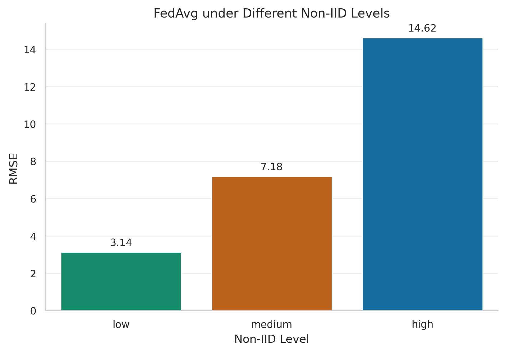

注：图 7 展示了不同 Non-IID 程度下 FedAvg 的误差变化趋势。

### 不同客户端数量下的 FedAvg 表现

客户端数量扩展实验进一步考察了 3、5 与 8 个客户端配置下的性能变化。该实验并不用于给出“客户端越多越好”或“客户端越少越好”的绝对规律，而是用于观察数据多样性增加与联邦优化复杂度提升之间可能存在的权衡。

**表 6 不同客户端数量下 FedAvg 的预测性能**

| 客户端数量 | MSE 均值 | RMSE 均值 | MAE 均值 | MAPE 均值 |
|---|---:|---:|---:|---:|
| 3 | 46.1328 | 6.1716 | 5.0023 | 6.3529% |
| 5 | 69.6236 | 7.1846 | 5.7256 | 51.5859% |
| 8 | 64.3814 | 6.8067 | 5.3965 | 37.4893% |

结果显示，3 个客户端时误差最低，8 个客户端时略优于 5 个客户端，但并未形成单调关系。一个合理的解释是：当客户端数量变化时，数据多样性、局部样本规模与优化协调难度会同步变化；某些设置下，多样性提升带来的收益可能会被额外的异构性和优化不稳定性部分抵消。因此，这一实验更适宜被理解为“客户端组织方式会影响 FedAvg 表现”，而不是简单的规模规律。

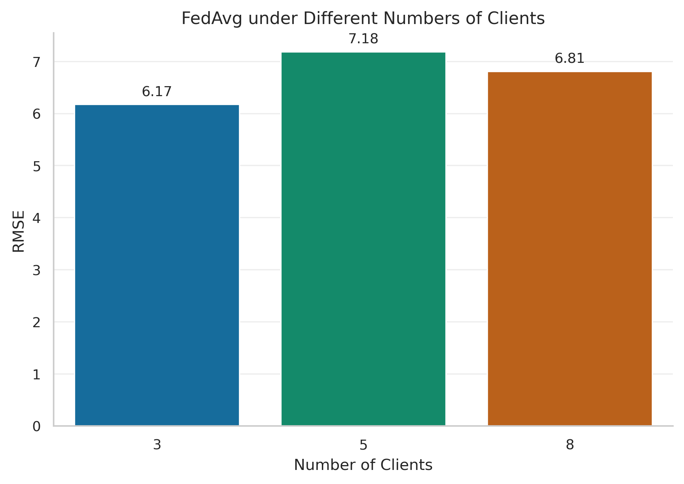

注：图 8 展示了不同客户端数量条件下 FedAvg 的误差变化趋势。

### FedAvg 框架下的特征消融结果

特征消融实验用于考察不同输入特征组合在同一 FedAvg 框架下的稳定性。需要强调的是，这里比较的是输入特征配置，而不是不同聚合策略。所有数值均来自仅采用 FedAvg 聚合的实验结果，不涉及探索性聚合方法。

**表 7 FedAvg 框架下的特征消融结果**

| 特征组合 | MSE 均值 | RMSE 均值 | MAE 均值 | MAPE 均值 |
|---|---:|---:|---:|---:|
| 仅流量特征 | 69.6236 | 7.1846 | 5.7256 | 51.5859% |
| 流量 + 时间特征 | 107.3548 | 8.9726 | 7.4027 | 80.1533% |
| 流量 + 事件特征 | 72.1918 | 7.2675 | 5.8626 | 57.3154% |
| 流量 + 区域特征 | 72.2081 | 7.3037 | 5.8882 | 59.3951% |
| 完整特征 | 104.2930 | 8.8561 | 7.2729 | 79.4819% |

从当前结果看，`仅流量特征` 配置取得了最低的整体误差，而 `流量 + 事件特征` 与 `流量 + 区域特征` 的表现与其较为接近；相较之下，`流量 + 时间特征` 和 `完整特征` 配置的误差更高。这一现象说明，在当前增强异质性设置下，附加特征并不必然转化为更稳定的收益，部分特征组合可能引入了更复杂的跨客户端分布差异。由于不同配置之间仍伴随较大的方差，相关结论应理解为趋势性结果，而不宜被夸大为对所有场景均成立的强规律。

特征消融结果主要用于解释输入特征配置对 FedAvg 增强实验表现的影响，而不改变 FedAvg 作为全文唯一联邦聚合主线的方法定位。

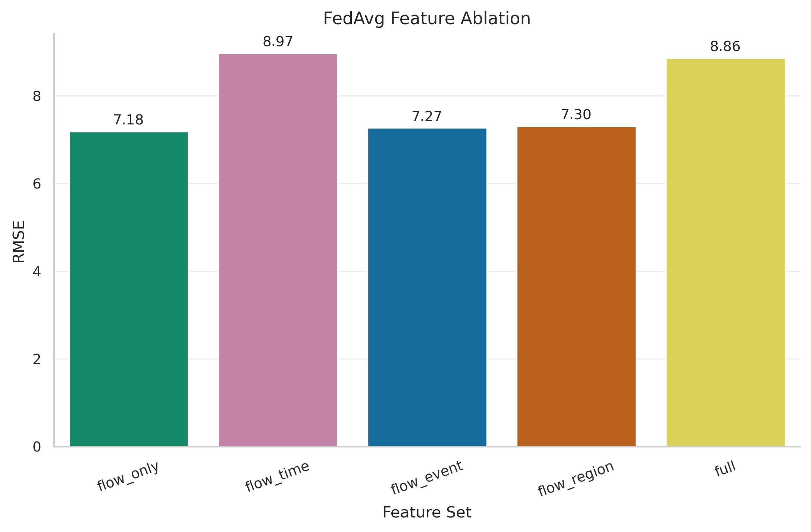

注：图 9 展示了不同输入特征组合下 FedAvg 的误差变化趋势。

## 收敛性分析

基础实验的收敛结果需要区分 CNN 与 GCN 两条路径。CNN 基础实验的主训练轮次为 10，但收敛轨迹记录了 15 轮；GCN 基础实验的训练与收敛记录均为 10 轮。CNN 的平均验证 RMSE 从第 1 轮的 `0.3170` 快速下降到第 5 轮附近的 `0.0662`，并在第 10 至 15 轮稳定在约 `0.0645` 至 `0.0686` 区间；GCN 的平均验证 RMSE 则从第 1 轮的 `0.0676` 下降到第 10 轮的 `0.0564`。

这说明标准 FedAvg 在合成交通流场景中能够在有限通信轮次内形成稳定的全局模型，而且这种收敛稳定性在 CNN 与 GCN 两类空间模块下均可观察到。因此，收敛收益主要来自统一的联邦训练协议，而不是某一特定局部模型的偶然表现。

多随机种子收敛统计结果显示，基础 CNN 的最终轮验证集 RMSE 为 `0.0686 ± 0.0082`，基础 GCN 的最终轮验证集 RMSE 为 `0.0564 ± 0.0034`，进一步表明基础 FedAvg 在不同随机初始化条件下仍能保持较稳定的收敛终点。增强实验的收敛统计结果还表明，CNN 增强实验中 FedAvg 的最终轮验证集 RMSE 为 `7.3178 ± 0.6780`，对应增强设置的结果为 `7.3146 ± 0.6804`；GCN 增强实验中 FedAvg 的最终轮验证集 RMSE 为 `7.5583 ± 0.5910`，对应增强设置的结果为 `7.4103 ± 0.6005`。这些结果说明，标准 FedAvg 在基础场景和增强场景下均能够形成可重复的收敛趋势。

## 鲁棒性实验

鲁棒性实验涵盖客户端掉线、通信延迟和梯度噪声三类扰动。此处的梯度噪声应理解为模拟梯度扰动，用于分析联邦训练对随机参数扰动的敏感性，而不构成正式差分隐私机制。为更直观地呈现三类联邦扰动场景下的整体变化，本文采用多随机种子鲁棒性 RMSE 汇总图作为正文主图，并将单次运行下的分扰动曲线作为附录图件，用于补充展示误差分布与场景间差异。正文鲁棒性结论以五随机种子统计结果为主要依据。

**表 8 鲁棒性实验五随机种子统计结果**

| 扰动场景 | RMSE | MAE | MAPE | R² |
|---|---:|---:|---:|---:|
| 客户端掉线率 0.0 | 7.7210 ± 0.4694 | 6.0880 ± 0.6071 | 50.4387 ± 33.8852 | 0.1867 ± 0.0923 |
| 客户端掉线率 0.2 | 7.5768 ± 0.5060 | 5.9475 ± 0.5709 | 48.3667 ± 31.5024 | 0.2212 ± 0.0756 |
| 客户端掉线率 0.4 | 7.5882 ± 0.5381 | 5.9534 ± 0.5764 | 46.4964 ± 31.6569 | 0.2289 ± 0.0721 |
| 通信延迟 0 | 7.7210 ± 0.4694 | 6.0880 ± 0.6071 | 50.4387 ± 33.8852 | 0.1867 ± 0.0923 |
| 通信延迟 1 | 7.9783 ± 0.5793 | 6.3644 ± 0.7326 | 54.3768 ± 39.2385 | 0.1315 ± 0.1059 |
| 通信延迟 2 | 7.8319 ± 0.5282 | 6.2225 ± 0.6427 | 53.1185 ± 38.4140 | 0.1647 ± 0.0612 |
| 梯度噪声 0.00 | 7.7210 ± 0.4694 | 6.0880 ± 0.6071 | 50.4387 ± 33.8852 | 0.1867 ± 0.0923 |
| 梯度噪声 0.02 | 7.7203 ± 0.3707 | 6.0837 ± 0.4399 | 46.5238 ± 27.8278 | 0.2097 ± 0.1132 |
| 梯度噪声 0.05 | 8.0273 ± 0.3277 | 6.3916 ± 0.4338 | 50.9977 ± 33.5397 | 0.1222 ± 0.1043 |

由表 8 可知，客户端掉线从 `0.0` 增加到 `0.4` 时，RMSE 未出现明显恶化，说明 FedAvg 对一定比例客户端缺失具有较好的容忍度；通信延迟 `1` 与 `2` 相较于无延迟条件均表现出更高误差，说明时延会削弱聚合效率；梯度噪声 `0.02` 条件下总体仍较稳定，而 `0.05` 时出现了一定程度的退化。这表明 FedAvg 在联邦扰动场景下具有一定鲁棒性，但通信延迟和较强噪声仍是更值得关注的影响因素。

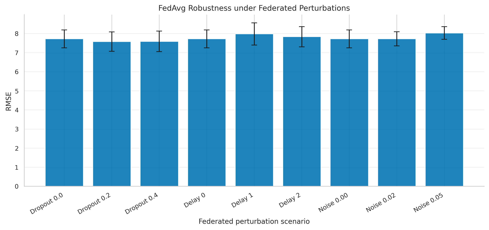

注：图 10 展示了 FedAvg 在客户端掉线、通信延迟和梯度扰动三类场景下的 RMSE 均值与标准差。该图仅展示标准 FedAvg 的多随机种子结果，用于说明不同扰动场景下的误差变化趋势。

## GCN 图结构与动态图分析

### 增强 GCN 默认场景的五随机种子结果

增强 GCN 默认场景的多随机种子统计结果显示，FedAvg 的 RMSE、MAE 和 MAPE 分别为 `6.5973 ± 0.2835`、`4.9860 ± 0.3413` 和 `37.8112 ± 22.9801`；Independent 的对应结果分别为 `7.5507 ± 0.2503`、`5.8670 ± 0.2695` 和 `30.2367 ± 17.2021`。虽然 Independent 在 MAPE 上较低，但 FedAvg 在 RMSE、MAE 和 `R²` 上表现更优，因此仍应以多指标综合判断图结构联邦训练表现。

### 固定图与动态图的单种子趋势分析

固定图与动态图比较主要用于分析图结构变化对预测误差的趋势影响。需要强调的是，该部分仍属于单随机种子趋势性证据，与前述五随机种子统计结果并不具有相同统计强度。因此，固定图与动态图之间的差异不能被解释为强统计结论，只能说明时段相关图结构具有进一步研究价值。

**表 9 GCN 固定图与动态图结果表（FedAvg 行）**

| 图类型 | MSE 均值 | RMSE 均值 | MAE 均值 | MAPE 均值 | 说明 |
|---|---:|---:|---:|---:|---|
| 固定图 | 49.6998 | 6.2163 | 4.8295 | 23.8204% | 固定邻接基准 |
| 早高峰动态图 | 49.1631 | 6.1907 | 4.8069 | 23.7915% | 略优于固定图 |
| 晚高峰动态图 | 49.1752 | 6.1912 | 4.8071 | 23.7922% | 略优于固定图 |
| 平峰动态图 | 49.1648 | 6.1906 | 4.8067 | 23.7922% | 略优于固定图 |

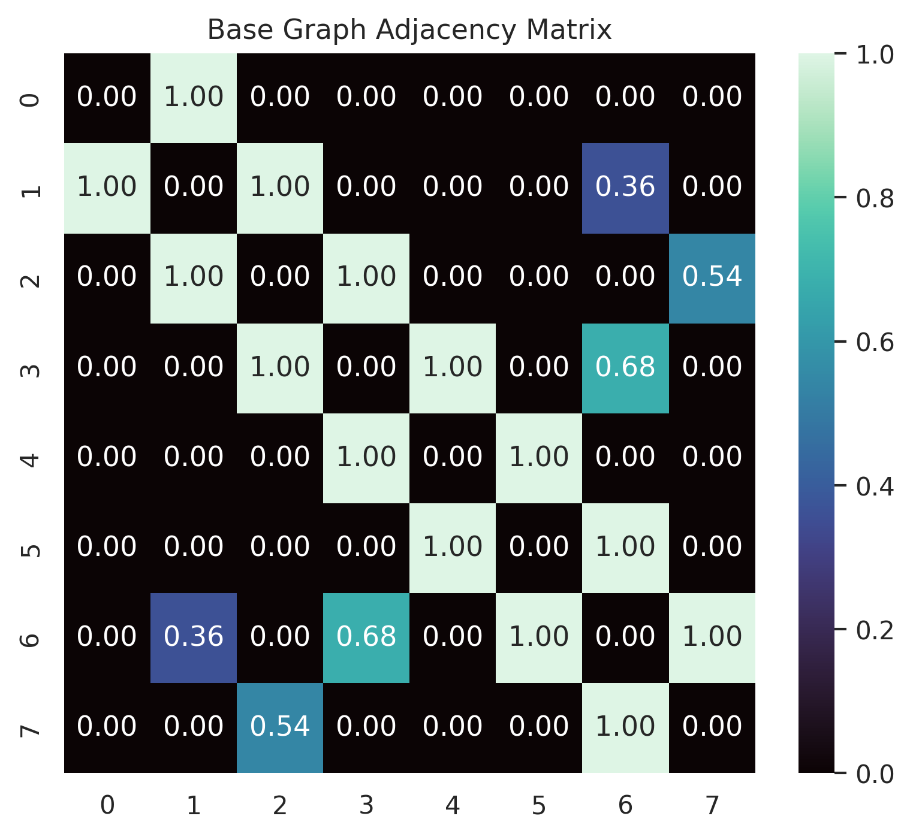

注：图 11 展示了基础 GCN 实验所采用的邻接矩阵结构。

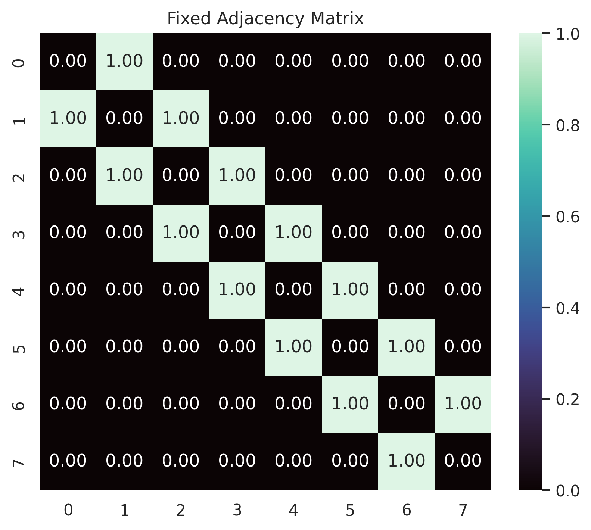

注：图 12 展示了增强 GCN 实验所采用的固定图邻接矩阵结构。

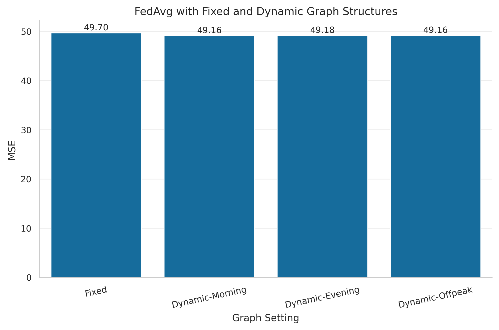

注：图 13 基于单一随机种子结果，仅用于展示固定图与动态图设置下的趋势性差异，不作为强统计结论。

## 图表、表格与伪代码安排

本文正文图表围绕主实验结论展开，误差分布、随机种子配对关系和单类扰动曲线作为补充材料展示。正文首先给出基础仿真数据集构造示意图和增强仿真数据集 Non-IID 构造示意图，用于说明受控弱异质场景与复杂异质场景之间的差异；随后展示基础主结果图、收敛曲线、增强异质性趋势图、鲁棒性 RMSE 汇总图以及 GCN 图结构示意图。附录保留 RMSE 箱线图、随机种子配对图和多指标扰动补充图。正文图表均围绕标准 FedAvg 聚合展开，不将探索性加权策略图件纳入主文结论。

## 小结

综上，仿真实验从基础结构、异质性扩展、收敛过程、扰动鲁棒性和图结构建模等多个角度验证了标准 FedAvg 在联邦交通流量预测任务中的适用性。实验结果表明，基础实验在轻度样本量不平衡、空间结构一致和弱异质性数据条件下验证了 FedAvg 的基本协同建模能力，且 CNN 与 GCN 路径下的 FedAvg 均优于 Independent；增强异质性场景中的 Non-IID 分层、客户端数量变化和特征消融结果进一步表明，客户端分布差异、参与规模和输入特征配置都会影响联邦预测表现；鲁棒性分析显示，FedAvg 对一定程度的客户端掉线和弱梯度扰动具有容忍度，但通信延迟与较强噪声仍会造成性能下降；图结构分析则表明，显式图建模能够为交通流空间关系刻画提供补充支持。总体来看，标准 FedAvg 能够在联邦交通流量预测任务中形成较稳定的协同建模效果，但在高异质性和高扰动环境下仍存在进一步优化空间。
